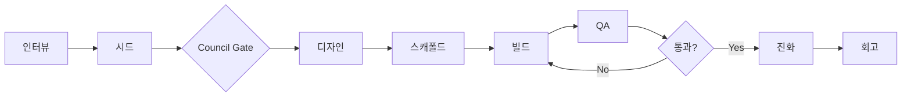

# SAMVIL — AI 바이브코딩 하네스 `v4.5.1`

> **한 줄 입력 → 자가 진화하는 견고한 시스템**
>
> "뿌리의 힘으로 벼려내다" (Sam=인삼 + Vil=모루)
>
> 💡 **권장 모델**: Claude Sonnet 4.6 (Design 기준 측정값 **GLM 25m+ stall 대비 6배+ 가속**, 4m 18s 완료). `references/cost-aware-mode.md` 참조. GLM·GPT도 **v3-017 호환성 보강** 덕분에 작동하지만, 메인 세션만 저비용 모델 두고 설계는 Sonnet에 라우팅하는 **cost-aware mode**가 품질·비용 균형점.

```
/samvil "할일 관리 앱"        → Next.js 웹앱
/samvil "매일 날씨 슬랙봇"    → Python 자동화 스크립트
/samvil "간단한 점프 게임"    → Phaser 웹 게임
/samvil "습관 트래커 모바일"  → Expo 모바일 앱
/samvil "매출 대시보드"       → Recharts 대시보드
```

**v3.32.0 "Final E2E Bundle"** — blocked QA에서 evolve/rebuild/post-rebuild QA/closure까지 이어지는 전체 체인을 하나의 최종 bundle로 검증하는 릴리스입니다.

> **v3.32.0 주요 추가** (2026-04-26):
> - **Final E2E bundle** — `materialize_final_e2e_bundle`이 `.samvil/final-e2e-bundle.json`을 생성.
> - **Whole-chain consistency gate** — QA route, evolve apply, rebuild handoff, reentry, scaffold output, post-rebuild QA, cycle closure가 같은 seed hash/version을 가리키는지 검증.
> - **Final status surface** — `samvil-status`와 `build_run_report`가 final E2E pass/blocked와 issue count를 노출.
> - **검증**: 945 unit tests · 175 MCP tools · Phase 30 dogfood PASS · default release runner PASS · release evidence bundle 생성 PASS · pre-commit-check PASS.

**v3.31.0 "Evolve Cycle Closure"** — post-rebuild QA 결과가 실제로 새 판정인지 확인한 뒤 cycle을 닫을지, 다시 evolve할지, 실패로 멈출지 파일 계약으로 고정하는 릴리스입니다.

> **v3.31.0 주요 추가** (2026-04-26):
> - **Cycle closure artifact** — `materialize_evolve_cycle_closure`가 `.samvil/evolve-cycle.json`을 생성.
> - **Fresh QA guard** — post-rebuild QA 요청보다 최신 iteration인 QA 결과만 closure 판정에 사용.
> - **Closure routing** — QA PASS는 `closed -> samvil-retro`, QA REVISE는 `continue_evolve -> samvil-evolve`, QA FAIL은 `failed -> samvil-retro`로 고정.
> - **검증**: 938 unit tests · 173 MCP tools · Phase 29 dogfood PASS · default release runner PASS · release evidence bundle 생성 PASS · pre-commit-check PASS.

**v3.30.0 "Post-Rebuild QA Rejudge"** — 재빌드 산출물이 현재 evolved seed와 일치할 때만 QA 재판정 요청을 만들고, 다음 호스트가 `samvil-qa`로 이어갈 수 있게 고정하는 릴리스입니다.

> **v3.30.0 주요 추가** (2026-04-26):
> - **Post-rebuild QA artifact** — `materialize_post_rebuild_qa`가 `.samvil/post-rebuild-qa.json`을 생성.
> - **Scaffold output hash gate** — `.samvil/scaffold-output.json`의 seed version/hash가 현재 seed와 맞을 때만 QA 재판정 허용.
> - **QA rejudge continuation** — `samvil-status`와 `build_run_report`가 post-rebuild QA readiness와 `samvil-qa` next skill을 노출.
> - **검증**: 931 unit tests · 171 MCP tools · Phase 28 dogfood PASS · default release runner PASS · release evidence bundle 생성 PASS · pre-commit-check PASS.

**v3.29.0 "Rebuild Reentry Contract"** — rebuild handoff 이후 다음 호스트가 seed 경로/버전/hash를 추론하지 않고 바로 scaffold에 재진입할 수 있도록 명시적 scaffold input을 남기는 릴리스입니다.

> **v3.29.0 주요 추가** (2026-04-26):
> - **Rebuild reentry artifact** — `materialize_rebuild_reentry`가 `.samvil/rebuild-reentry.json`을 생성.
> - **Scaffold input contract** — reentry가 ready일 때 `.samvil/scaffold-input.json`에 seed path, version, sha256, next skill을 고정.
> - **Status/run-report reentry surface** — `samvil-status`와 `build_run_report`가 rebuild reentry readiness와 scaffold 재진입 경로를 노출.
> - **검증**: 924 unit tests · 169 MCP tools · Phase 27 dogfood PASS · default release runner PASS · release evidence bundle 생성 PASS · pre-commit-check PASS.

**v3.28.0 "Evolve Rebuild Handoff"** — evolved seed 적용 후 다음 호스트가 바로 재스캐폴드로 이어갈 수 있도록 portable rebuild marker를 남기는 릴리스입니다.

> **v3.28.0 주요 추가** (2026-04-26):
> - **Rebuild handoff artifact** — `materialize_evolve_rebuild_handoff`가 `.samvil/evolve-rebuild.json`을 생성.
> - **Portable continuation marker** — 적용된 seed를 기준으로 `.samvil/next-skill.json`을 `samvil-scaffold`로 갱신.
> - **Status/run-report rebuild surface** — `samvil-status`와 `build_run_report`가 rebuild handoff readiness와 next skill을 노출.
> - **검증**: 917 unit tests · 167 MCP tools · Phase 26 dogfood PASS · default release runner PASS · release evidence bundle 생성 PASS · pre-commit-check PASS.

**v3.27.0 "Evolve Apply Plan"** — 검토된 evolve proposal을 seed preview와 hash-guarded apply plan으로 바꿔, 안전하게 `project.seed.json`을 다음 버전으로 적용하는 릴리스입니다.

> **v3.27.0 주요 추가** (2026-04-26):
> - **Guarded apply plan** — `materialize_evolve_apply_plan`이 `.samvil/evolve-apply-plan.json`, `.samvil/evolved-seed.preview.json`, `.samvil/evolve-apply-report.md`를 생성.
> - **Seed hash gate** — `apply_evolve_apply_plan`이 원본 seed hash를 검증한 뒤에만 `project.seed.json`을 갱신하고 `seed_history/vN.json` 백업과 diff를 남김.
> - **Status/run-report apply surface** — `samvil-status`와 `build_run_report`가 apply readiness/applied 상태, version target, mutation count를 노출.
> - **검증**: 910 unit tests · 165 MCP tools · Phase 25 dogfood PASS · default release runner PASS · release evidence bundle 생성 PASS · pre-commit-check PASS.

**v3.26.0 "Evolve Proposal Materialization"** — evolve context를 바로 seed 수정으로 이어가지 않고, 먼저 검토 가능한 proposal artifact로 고정하는 릴리스입니다.

> **v3.26.0 주요 추가** (2026-04-26):
> - **Evolve proposal artifacts** — `materialize_evolve_proposal`이 `.samvil/evolve-proposal.json`과 `.samvil/evolve-proposal.md`를 생성.
> - **Proposal-only seed evolution** — blocked functional QA를 `clarify_or_split_ac` 제안으로 변환하되 `project.seed.json`은 수정하지 않음.
> - **Status/run-report proposal surface** — `samvil-status`와 `build_run_report`가 proposal readiness, change count, next action을 노출.
> - **검증**: 903 unit tests · 162 MCP tools · Phase 24 dogfood PASS · default release runner PASS · release evidence bundle 생성 PASS · pre-commit-check PASS.

**v3.25.0 "Evolve Intake Context"** — QA recovery route가 `samvil-evolve`로 이어질 때 seed, QA issue, route, ground-truth artifact를 하나의 파일 기반 context로 고정하는 릴리스입니다.

> **v3.25.0 주요 추가** (2026-04-26):
> - **Evolve context artifact** — `materialize_evolve_context`가 `.samvil/evolve-context.json`을 생성.
> - **File-based evolve intake** — `project.seed.json`, `qa-results.json`, `qa-routing.json`, `seed_history`를 묶어 wonder/reflect 입력으로 제공.
> - **Status/run-report evolve surface** — `samvil-status`와 `build_run_report`가 evolve focus와 issue count를 노출.
> - **검증**: 897 unit tests · 160 MCP tools · Phase 23 dogfood PASS · default release runner PASS · release evidence bundle 생성 PASS · pre-commit-check PASS.

**v3.24.0 "QA Recovery Routing"** — blocked QA convergence를 다음 실행 경로로 바꿔 `samvil-evolve`, `samvil-build`, `samvil-retro` 중 어디로 이어갈지 고정하는 릴리스입니다.

> **v3.24.0 주요 추가** (2026-04-26):
> - **QA recovery route** — `qa_routing.py`가 blocked QA issue family를 분석해 1차 route와 alternative routes를 산출.
> - **Portable continuation** — `materialize_qa_recovery_routing`이 `.samvil/qa-routing.json`과 `.samvil/next-skill.json`을 생성.
> - **Status/run-report route surface** — `samvil-status`와 `build_run_report`가 blocked QA에서 generic 문구 대신 route action을 우선 노출.
> - **검증**: 892 unit tests · 158 MCP tools · Phase 22 dogfood PASS · default release runner PASS · release evidence bundle 생성 PASS · pre-commit-check PASS.

**v3.23.0 "QA Convergence Gate"** — 반복 QA revise loop가 실제로 수렴하는지 판단하고, 같은 이슈가 반복되면 blind auto-fix를 멈추는 릴리스입니다.

> **v3.23.0 주요 추가** (2026-04-26):
> - **QA convergence gate** — `evaluate_qa_convergence`가 `qa_history`와 현재 synthesis의 `issue_ids`를 비교해 `continue / blocked / failed / pass`를 판정.
> - **Blocked loop protection** — 동일 QA 이슈가 2회 연속 남거나 이슈 수가 줄지 않으면 `qa_blocked` 이벤트와 수동 개입 next action을 생성.
> - **Status/run-report priority** — `samvil-status`와 `build_run_report`가 blocked/failed convergence를 일반 REVISE보다 우선 노출.
> - **검증**: 885 unit tests · 156 MCP tools · Phase 21 dogfood PASS · default release runner PASS · release evidence bundle 생성 PASS · pre-commit-check PASS.

**v3.22.0 "QA Materialization"** — 중앙 QA synthesis 판정을 실제 `.samvil` 산출물과 status surface에 고정한 릴리스입니다.

> **v3.22.0 주요 추가** (2026-04-26):
> - **QA artifact materialization** — `materialize_qa_synthesis`가 `.samvil/qa-results.json`, `.samvil/qa-report.md`, `.samvil/events.jsonl`, `project.state.json.qa_history`를 생성/갱신.
> - **Status QA panel** — `samvil-status`와 `build_run_report`가 QA verdict, Pass 2 counts, Pass 3 verdict, next action을 노출.
> - **Phase 20 dogfood** — report/results/events/state/run-report/status가 같은 synthesis verdict를 가리키는지 검증.
> - **검증**: 879 unit tests · 155 MCP tools · Phase 20 dogfood PASS · default release runner PASS · release evidence bundle 생성 PASS · pre-commit-check PASS.

**v3.21.0 "QA Synthesis Gate"** — 독립 QA가 수집한 Pass 2/3 증거를 메인 세션이 하나의 기계적 `PASS / REVISE / FAIL` 판정으로 합성하는 릴리스입니다.

> **v3.21.0 주요 추가** (2026-04-26):
> - **Central QA synthesis** — `mcp/samvil_mcp/qa_synthesis.py`와 MCP `synthesize_qa_evidence`가 Pass 1, 독립 Pass 2, 독립 Pass 3 JSON을 중앙 판정으로 합성.
> - **Machine-readable QA evidence** — `qa-functional`은 `QA_FUNCTIONAL_JSON`, `qa-quality`는 `QA_QUALITY_JSON`을 반환하도록 계약화.
> - **Ownership guard** — 독립 agent가 `.samvil/qa-report.md`, `.samvil/events.jsonl`, `project.state.json`, overall verdict를 쓰려 하면 synthesis가 `REVISE`로 차단.
> - **검증**: 875 unit tests · 154 MCP tools · Phase 19 dogfood PASS · default release runner PASS · release evidence bundle 생성 PASS · pre-commit-check PASS.

**v3.20.0 "Independent Evidence Contract"** — design/build/QA/evolve에 흩어진 Independent Evidence, Central Verdict 원칙을 실행 가능한 dogfood 계약으로 고정한 릴리스입니다.

> **v3.20.0 주요 추가** (2026-04-26):
> - **Phase 18 dogfood** — `scripts/phase18-independent-evidence-dogfood.py`가 blueprint feasibility, structured build events, QA taxonomy, independent QA ownership, evolve context를 교차 검증.
> - **Release runner integration** — Phase 18 계약 검증이 기본 release checks에 포함되어 pre-commit 전에 drift를 직접 드러냄.
> - **QA taxonomy cleanup** — `PARTIAL`은 통과 가능한 evidence-limited 상태로 유지하고, `UNIMPLEMENTED`/`FAIL`만 revise/fail 트리거로 명확화.
> - **검증**: 867 unit tests · 153 MCP tools · Phase 18 dogfood PASS · default release runner PASS · release evidence bundle 생성 PASS · pre-commit-check PASS.

**v3.19.1 "Verified Publisher Fixture Patch"** — publisher fixture dry-run이 `--skip-local-release-checks`일 때 machine-local `.samvil/release-report.json` 상태를 읽지 않도록 고친 패치입니다.

> **v3.19.1 주요 수정** (2026-04-26):
> - **Fixture isolation** — skipped local release checks는 explicit pass stub을 사용해 CI/local `.samvil` 상태 차이에 영향받지 않음.
> - **검증**: 866 unit tests · 153 MCP tools · publisher fixture tests PASS · default release runner PASS · release evidence bundle 생성 PASS · pre-commit-check PASS.

**v3.19.0 "Verified Release Publisher"** — branch push, GitHub Actions 대기, 원격 artifact gate 검증, tag push를 하나의 publish guard로 묶어 release tag가 remote evidence pass 이후에만 올라가게 한 릴리스입니다.

> **v3.19.0 주요 추가** (2026-04-26):
> - **Verified publisher** — `scripts/publish-verified-release.py`가 main push 후 Actions 완료와 artifact gate pass를 확인한 뒤 tag를 push.
> - **Publish guard core** — clean tree, version sync, local/remote tag existence, local release gate, remote release gate를 함께 평가.
> - **Dry-run fixture mode** — 실제 push 없이 pass/blocked remote evidence 흐름을 테스트.
> - **검증**: 866 unit tests · 153 MCP tools · publisher fixture tests PASS · default release runner PASS · release evidence bundle 생성 PASS · pre-commit-check PASS.

**v3.18.0 "Remote Release Gate"** — GitHub Actions run success와 `samvil-release-evidence` artifact 내부 `release-runner.json` gate pass를 함께 확인해, 태그 전 원격 release evidence까지 막는 릴리스입니다.

> **v3.18.0 주요 추가** (2026-04-26):
> - **Remote release gate** — run status/conclusion, expected HEAD, artifact report status, artifact gate verdict를 함께 평가.
> - **Live `gh` CLI** — `scripts/check-remote-release-gate.py`가 최신 main run의 artifact를 다운로드하고 gate를 검증.
> - **Fixture mode** — GitHub 접근 없이 pass/fail/head mismatch/block artifact 케이스를 fixture JSON으로 회귀 테스트.
> - **검증**: 858 unit tests · 153 MCP tools · remote gate fixture tests PASS · live remote gate PASS · default release runner PASS · release evidence bundle 생성 PASS · pre-commit-check PASS.

**v3.17.3 "External CI Mirror Fixture Patch"** — ignored local `harness-feedback.log`에 의존하던 retro schema 테스트를 committed fixture 기반으로 바꿔, GitHub Actions release runner가 로컬 상태 없이 통과하도록 한 패치입니다.

> **v3.17.3 주요 수정** (2026-04-26):
> - **Committed retro fixture** — `mcp/tests/fixtures/harness-feedback.json`을 추가하고 schema 테스트가 이 fixture를 읽게 수정.
> - **검증**: 851 unit tests · 153 MCP tools · CI workflow validator PASS · default release runner PASS · release evidence bundle 생성 PASS · pre-commit-check PASS.

**v3.17.2 "External CI Mirror Test Runtime"** — CI venv에도 local pre-commit과 같은 pytest runtime을 설치해, GitHub Actions release runner가 full pre-commit까지 재현되도록 한 패치입니다.

> **v3.17.2 주요 수정** (2026-04-26):
> - **CI pytest runtime** — `mcp/.venv`에 `pytest`와 `pytest-asyncio`를 명시 설치해 pre-commit full suite가 원격에서도 실행되게 수정.
> - **검증**: 851 unit tests · 153 MCP tools · CI workflow validator PASS · default release runner PASS · release evidence bundle 생성 PASS · pre-commit-check PASS.

**v3.17.1 "External CI Mirror Patch"** — v3.17.0의 GitHub Actions mirror를 실제 실패에 닫히도록 보강한 패치입니다. Playwright browser executable 설치를 명시하고, `tee` 파이프가 release runner 실패를 숨기지 못하게 했습니다.

> **v3.17.1 주요 수정** (2026-04-26):
> - **Playwright runtime install** — CI에서 `playwright@1.52.0 install --with-deps chromium`으로 Phase 8 브라우저 executable을 설치.
> - **Pipefail enforcement** — release runner와 bundle builder step에 `set -o pipefail`을 적용해 artifact 내부 blocked 상태가 job success로 숨지 않게 수정.
> - **검증**: 851 unit tests · 153 MCP tools · CI workflow validator PASS · default release runner PASS · release evidence bundle 생성 PASS · pre-commit-check PASS.

**v3.17.0 "External CI Mirror"** — v3.16의 release runner와 evidence bundle을 GitHub Actions에서도 실행해, 로컬 세션 밖에서도 같은 release readiness 증거를 남기는 릴리스입니다.

> **v3.17.0 주요 추가** (2026-04-26):
> - **GitHub Actions mirror** — PR, main push, manual dispatch에서 `scripts/run-release-checks.py --format json`을 실행.
> - **CI evidence bundle** — CI에서 `scripts/build-release-bundle.py --format json`을 실행해 release report와 summary를 생성.
> - **Artifact upload** — `samvil-release-evidence` artifact로 report, summary, runner JSON, bundle JSON을 업로드.
> - **Workflow contract validator** — `scripts/validate-ci-workflow.py`와 pytest가 Actions runtime/commands/artifact 계약을 로컬에서 검증.
> - **검증**: 851 unit tests · 153 MCP tools · CI workflow validator PASS · default release runner PASS · release evidence bundle 생성 PASS · Phase 12/11/10/8 regressions PASS · pre-commit-check PASS.

**v3.16.0 "Release Evidence Bundle"** — v3.15의 runner-generated release report를 사람이 검토하기 쉬운 `.samvil/release-summary.md`로 묶어, 다음 세션/리뷰어가 파일 하나로 release readiness를 판단할 수 있게 한 릴리스입니다.

> **v3.16.0 주요 추가** (2026-04-26):
> - **Evidence bundle** — release gate verdict, release report summary, git branch/head/tags, dirty state, version sync를 하나의 markdown으로 렌더링.
> - **Check evidence view** — check별 command, exit code, duration, message와 실패 시 stdout/stderr tail을 bundle에 포함.
> - **Bundle CLI/MCP** — `scripts/build-release-bundle.py`와 build/read/render release evidence bundle MCP 도구 추가.
> - **Status surface** — `samvil-status.py` human/JSON 출력에서 최신 `.samvil/release-summary.md` 경로 표시.
> - **검증**: 849 unit tests · 153 MCP tools · default release runner PASS · release evidence bundle 생성 PASS · Phase 14/13/12/11/10/8 regressions PASS · pre-commit-check PASS.

**v3.15.0 "Release Check Runner"** — v3.14의 release readiness gate 위에 실제 명령 실행 runner를 얹어 Phase 12/11/10/8과 pre-commit 결과를 직접 실행 증거로 `.samvil/release-report.json`에 기록하는 릴리스입니다.

> **v3.15.0 주요 추가** (2026-04-26):
> - **Release check runner** — named release check commands를 실행하고 exit code, duration, stdout/stderr tail을 기록.
> - **Runner-generated report** — `scripts/run-release-checks.py`와 MCP `run_release_checks`가 `.samvil/release-report.json`을 자동 생성.
> - **Default release command set** — Phase 12 release readiness, Phase 11 repair orchestration, Phase 10 repair regression, Phase 8 browser inspection, full pre-commit을 순서대로 실행.
> - **Runner dogfood** — all-pass, command-fail, timeout 세 상태에서 release gate pass/blocked와 status surface를 검증.
> - **검증**: 845 unit tests · 150 MCP tools · default release runner PASS · Phase 13 dogfood PASS · Phase 12/11/10/8 regressions PASS · pre-commit-check PASS.

**v3.14.0 "Release Readiness Gate"** — v3.13의 repair orchestration 위에 release report와 release gate를 얹어 repair verified 이후에도 required release checks가 끝나기 전에는 최종 릴리스를 막는 릴리스입니다.

> **v3.14.0 주요 추가** (2026-04-26):
> - **Release report contract** — named release checks를 `.samvil/release-report.json`으로 정규화하고 pass/fail/missing summary를 기록.
> - **Release gate verdict** — repair gate가 blocked면 release도 blocked, release check 실패/누락도 blocked, 전체 통과 시 `ready to tag release`.
> - **Run report orchestration** — `.samvil/run-report.json`에 release summary와 release gate를 포함하고 repair gate 다음 우선순위로 release gate가 next action을 제어.
> - **Release MCP/status surface** — build/read/render release report, evaluate release gate MCP 도구와 `samvil-status.py` release summary 추가.
> - **검증**: 840 unit tests · 149 MCP tools · Phase 12 release readiness dogfood PASS · Phase 11/10/8 regressions PASS · pre-commit-check PASS.

**v3.13.0 "Repair Orchestration Gate"** — v3.12의 repair execution loop 위에 deterministic repair gate를 얹어 repair가 미검증이면 다음 단계 진행을 막고, 검증 완료 시 release checks로 명확히 넘기는 릴리스입니다.

> **v3.13.0 주요 추가** (2026-04-26):
> - **Repair gate verdict** — inspection/repair plan/repair report 상태를 읽어 `pass`, `blocked`, `not-applicable` verdict와 next action을 결정.
> - **Run report orchestration** — `.samvil/run-report.json`에 repair summary와 repair gate를 포함하고 blocked repair가 전체 next action을 우선 제어.
> - **Status surface** — `samvil-status.py` human/JSON 출력에서 repair gate verdict, reason, next action을 확인.
> - **Lifecycle + policy signals** — `repair_started`, `repair_plan_generated`, `repair_applied`, `repair_verified`, `repair_failed` 이벤트와 반복 repair type policy signal 후보 지원.
> - **검증**: 830 unit tests · 145 MCP tools · Phase 11 repair orchestration dogfood PASS · Phase 10 repair regression PASS · Phase 8 browser inspection regression PASS · pre-commit-check PASS.

**v3.12.0 "Inspection Repair Execution Loop"** — v3.11의 failure feedback 위에 repair plan, before/after repair report, 재검수 verified status를 얹어 1차 create→inspect→repair 루프를 닫은 릴리스입니다.

> **v3.12.0 주요 추가** (2026-04-26):
> - **Repair plan contract** — failed inspection report를 `.samvil/repair-plan.json`의 ordered repair actions로 변환.
> - **Repair report contract** — before/after inspection report를 비교해 resolved/remaining failures와 verified status를 기록.
> - **Repair MCP/status surface** — build/read/render repair plan/report MCP 도구와 `samvil-status.py` repair summary 추가.
> - **Repair dogfood** — `scripts/phase10-inspection-repair-dogfood.py`가 broken dashboard/game fixture를 repair plan → fixed after-inspection → verified repair report로 검증.
> - **검증**: 821 unit tests · 143 MCP tools · Phase 10 repair dogfood PASS · Phase 8 browser inspection regression PASS · pre-commit-check PASS.

**v3.11.0 "Inspection Feedback Loop"** — v3.10의 inspection gate 위에 실패 분류, repair hint, retro observation, status next action을 얹은 릴리스입니다.

> **v3.11.0 주요 추가** (2026-04-26):
> - **Failure taxonomy** — console error, layout overflow, screenshot missing, interaction failed, canvas blank, viewport load/evidence failure를 deterministic하게 분류.
> - **Repair hints** — failed inspection check마다 severity와 구체적인 repair hint를 report에 포함.
> - **Retro bridge** — `derive_inspection_observations`로 inspection failure를 `.samvil/retro-observations.jsonl` 후보로 변환.
> - **Status next action** — inspection fail이면 `samvil-status.py`가 일반 run action보다 inspection repair를 우선 추천.
> - **검증**: 814 unit tests · 137 MCP tools · broken-fixture feedback dogfood PASS · Phase 8 browser inspection regression PASS · pre-commit-check PASS.

**v3.10.0 "Real App Inspection Gate"** — v3.9의 browser runtime dogfood 위에 사용자 눈높이의 inspection report, desktop/mobile viewport evidence, console/overflow/interaction gate를 얹은 릴리스입니다.

> **v3.10.0 주요 추가** (2026-04-26):
> - **Inspection report contract** — `.samvil/inspection-evidence.json`을 `.samvil/inspection-report.json`으로 정규화하고 pass/fail summary와 markdown context를 생성.
> - **Inspection MCP/status surface** — `build_inspection_report`, `read_inspection_report`, `render_inspection_report` MCP 도구와 `samvil-status.py` inspection summary 추가.
> - **Real app inspection dogfood** — `scripts/phase8-real-app-inspection.py`가 Vite React SaaS dashboard와 Vite Phaser game을 실제 install/build/dev-server/Playwright로 검수.
> - **User-visible quality checks** — desktop/mobile viewport, screenshot artifact, console error 0, layout overflow 0, dashboard filter interaction, game canvas/input/score/restart를 확인.
> - **검증**: 809 unit tests · 136 MCP tools · real app inspection dogfood PASS · opt-in browser inspection pytest PASS · pre-commit-check PASS.

**v3.9.1 "Telemetry Classifier Patch"** — v3.9 browser dogfood 중 발견한 `install_started` 오분류를 닫은 안정화 패치입니다.

> **v3.9.1 주요 수정** (2026-04-26):
> - **Event classifier precision** — `stall`/`blocked` 판정을 단어 토큰 기준으로 강화해 `install_started`가 blocked로 분류되지 않게 수정.
> - **Regression coverage** — `install_started` + `install_complete`는 complete, `qa_stall_detected`와 `deploy_blocked`는 blocked로 남는 회귀 테스트 추가.
> - **Dogfood workaround 제거** — Phase 7 browser dogfood가 다시 `install_started`/`install_complete`를 그대로 기록하며 `retro=0`을 확인.
> - **검증**: telemetry tests PASS · browser runtime dogfood PASS · full pre-commit-check PASS.

**v3.9.0 "Browser Runtime Dogfood"** — v3.8의 local runtime dogfood 위에 실제 `npm install`, Vite dev server, Playwright Chromium DOM/canvas/input 검증을 얹은 릴리스입니다.

> **v3.9.0 주요 추가** (2026-04-26):
> - **Browser runtime dogfood** — `scripts/phase7-browser-runtime-dogfood.py`가 Vite React SaaS dashboard와 Vite Phaser browser game을 temp dir에 생성하고 실제 `npm install` + `npm run build`를 수행.
> - **Playwright Chromium checks** — dashboard는 heading/KPI/chart/table/filter interaction을 DOM에서 검증하고, game은 canvas nonblank pixel, ArrowRight input, score 증가, restart reset을 브라우저에서 검증.
> - **External package evidence** — v3.8까지 제외했던 network-dependent package install과 real browser path를 의도적으로 release dogfood에 포함.
> - **SAMVIL surface cross-check** — browser dogfood에서도 Domain Pack, Pattern Registry, Manifest, run report, status JSON, retro 후보 0개를 확인.
> - **검증**: 801 unit tests · 133 MCP tools · browser runtime dogfood PASS · direct pytest dogfood PASS · cross-host replay PASS · pre-commit-check PASS.

**v3.8.0 "Real Runtime Dogfood"** — v3.7의 full-chain dogfood 위에 실제 `npm run build`, `npm start`, localhost HTTP runtime, served HTML response 검증을 얹은 릴리스입니다.

> **v3.8.0 주요 추가** (2026-04-26):
> - **Real runtime dogfood** — `scripts/phase6-real-runtime-dogfood.py`가 SaaS dashboard와 browser game을 temp dir에 생성하고 `npm run build` + `npm start`를 실제 실행.
> - **HTTP response validation** — `/health`와 served HTML을 localhost에서 직접 읽어 KPI/filter/chart/table/empty state, canvas/input/score/collision/restart marker를 검증.
> - **SAMVIL surface cross-check** — runtime dogfood에서도 Domain Pack, Pattern Registry, Manifest, run report, status JSON, retro 후보 0개를 확인.
> - **Pytest integration** — `mcp/tests/test_phase6_real_runtime_dogfood.py`가 real runtime dogfood를 full suite에 포함.
> - **검증**: 801 unit tests · 133 MCP tools · real runtime dogfood PASS · cross-host replay PASS · pre-commit-check PASS.

**v3.7.0 "Dual Full-Chain Dogfood"** — v3.6의 Domain Pack runtime 위에 SaaS dashboard + browser game dual dogfood harness를 얹어 product-domain context, pattern context, generated source, QA, telemetry, status, retro를 한 번에 검증하는 릴리스입니다.

> **v3.7.0 주요 추가** (2026-04-26):
> - **Dual dogfood harness** — `scripts/phase5-dual-dogfood.py`가 `saas-dashboard`와 `browser-game` 프로젝트를 temp dir에 생성하고 full-chain regression을 수행.
> - **Cross-domain QA** — SaaS dashboard는 KPI/filter/empty/chart-table sync, browser game은 canvas/input/score loop/collision-restart를 검증.
> - **Telemetry/retro cross-check** — 두 시나리오 모두 events, verified claims, manifest, run report, status JSON, retro 후보 0개를 확인.
> - **Pytest integration** — `mcp/tests/test_phase5_dual_dogfood.py`가 dual dogfood를 full suite에 포함.
> - **검증**: 800 unit tests · 133 MCP tools · dual full-chain dogfood PASS · cross-host replay PASS · pre-commit-check PASS.

**v3.6.0 "Domain Packs"** — v3.5의 telemetry layer 위에 domain-specific product context, deterministic pack matching, and stage-scoped Interview/Design/Build/QA guidance를 얹은 릴리스입니다.

> **v3.6.0 주요 추가** (2026-04-26):
> - **Domain Pack registry** — `saas-dashboard`, `browser-game`, `mobile-habit` 3개 PoC pack을 추가하고 product/domain guidance를 skill body 밖으로 분리.
> - **Domain Pack MCP tools** — `list_domain_packs`, `read_domain_pack`, `render_domain_context`, `match_domain_packs` 제공.
> - **Stage-scoped context** — Interview/Design/Build/QA가 `render_domain_context(..., stage="<stage>")`로 필요한 도메인 질문, 엔티티, workflow, build/QA risk를 읽음.
> - **Deterministic matching** — seed의 `solution_type`, domain, text signals, core entity hits로 pack 후보를 점수화하고 confidence/reasons를 반환.
> - **검증**: 799 unit tests · 133 MCP tools · synthetic/live-ish domain dogfood · cross-host replay PASS · pre-commit-check PASS.

**v3.5.0 "Telemetry + Run Observability"** — v3.4의 multi-host runtime 위에 deterministic run report, event timeline taxonomy, MCP health signatures, retro observation feed, status surface를 얹은 릴리스입니다.

> **v3.5.0 주요 추가** (2026-04-26):
> - **Run telemetry snapshot** — `.samvil/run-report.json`을 build/read/render하는 MCP 도구 추가. project state, claims, events, MCP health, continuation marker를 한 화면 report로 합침.
> - **Event taxonomy** — stage events를 start/complete/fail/retry/blocked/skip/other로 분류하고 stage별 duration, failure/retry count를 계산.
> - **Retro observation feed** — failed/blocked stage, retry loop, MCP failure signature, pending claims를 deterministic retro candidate로 변환하고 `.samvil/retro-observations.jsonl`에 dedupe append.
> - **Status surface** — `scripts/samvil-status.py`가 run report를 우선 읽어 stage, gates, MCP health, continuation, next action, stage timeline을 표시.
> - **검증**: 787 unit tests · 129 MCP tools · synthetic/live repo dogfood · cross-host replay PASS · pre-commit-check PASS.

**v3.4.0 "Multi-Host Runtime + Pattern Registry"** — v3.3의 4-layer foundation 위에 실제 Codex/OpenCode continuation, ultra-thin skill migration harness, Pattern Registry, Manifest v2 intelligence, cross-host regression suite를 얹은 릴리스입니다.

> **v3.4.0 주요 추가** (2026-04-26):
> - **Skill migration harness** — `samvil-design` active body를 120줄 ultra-thin entry로 전환하고 649줄 legacy body를 보존. migrated skill thinness가 pre-commit에서 검증됨.
> - **Codex/OpenCode continuation** — `.samvil/next-skill.json` schema `1.0`, `references/host-continuation.md`, `scripts/host-continuation-smoke.py`.
> - **Pattern Registry** — Next.js, Vite, Phaser, Expo, Dashboard 패턴을 MCP `list_patterns`/`read_pattern`/`render_pattern_context`로 제공. Build/QA가 pattern context를 읽음.
> - **Manifest v2 intelligence** — schema `1.1`, TS/JS/Python import graph, module summaries, `imports:regex`/`summary:heuristic` confidence tags.
> - **Cross-host regression** — Claude-style `skill_tool`과 Codex-style `file_marker`가 같은 seed/design handoff 결과를 내는지 pre-commit에서 smoke.
> - **검증**: 773 unit tests · 124 MCP tools · cross-host replay PASS · pre-commit-check PASS.

**v3.3.1 "4-Layer Portability Foundation"** — Skill / MCP / Host Adapter / SSOT를 분리해 Claude Code에 갇히지 않는 구조를 만든 릴리스. Codebase Manifest, Decision Log ADR, Orchestrator, HostCapability가 추가되어 Codex/OpenCode 같은 다른 코딩 에이전트로 옮겨갈 기반이 생겼습니다.

**v3.2.0 "Contract Layer"** — v3.1.0 위에 Claim 레지스트리·Stage Gate 프레임워크·Role primitive·Model routing을 얹은 계약 기반 릴리스. 모든 stage 전환이 `.samvil/claims.jsonl`에 deterministic하게 기록되고 Generator ≠ Judge 규칙이 런타임에서 강제됩니다.

> **v3.2.0 주요 추가** (2026-04-25):
> - **Claim ledger (①)** — `.samvil/claims.jsonl`이 새 SSOT. 10개 type + Generator ≠ Judge 불변식 + file:line 증거 해상도.
> - **Stage gate framework (⑥)** — 8개 게이트, `samvil_tier`별 기준치, 3개 escalation check(`ac_testability`/`lifecycle_coverage`/`decision_boundary_clarity`), `--allow-warn`만 soft.
> - **Role primitive (⑤)** — 50개 에이전트에 `model_role:` frontmatter. generator/reviewer/judge/repairer/researcher/compressor 6역 + 런타임 G≠J 강제.
> - **AC leaf schema (③)** — 2 user + 12 AI-inferred 필드. testability 검사, `parallel_safety` 자동 계산.
> - **Model routing (④, Lite 흡수)** — `cost_tier` (frugal/balanced/frontier) + `.samvil/model_profiles.yaml`. "build on Opus, QA on Codex" 시나리오 exit-gate 통과.
> - **Interview v3.2 (②)** — 6 technique + 5 level + AUTO. `interview_level` 축 신설.
> - **Jurisdiction (⑦)** — AI/External/User 3등급 판정. git push, migration, auth 자동 escalation.
> - **Retro policy evolution (⑧)** — 4-stage observations/hypotheses/experiments/adopted. 21개 (initial estimate)가 experimental_policy로 자동 등록.
> - **Stagnation (⑩)** + **Consensus (⑨ 재정의)** — Council Gate A는 v3.2에서 opt-in, v3.3 제거. Consensus는 dispute resolver로 축소.
> - **Narrated observability** — `samvil narrate` + `view-claims.py`/`view-gates.py`/`samvil-status.py`.
> - **Performance budget (⑬)** + **Migration (⑫)** — `.samvil/performance_budget.yaml`, `samvil-update --migrate v3.2` with dry-run + rollback snapshot.
> - **Hard-wired 결선** — Plugin hooks(SessionStart bootstrap + PreToolUse/PostToolUse 필터) + MCP `save_event` 자동 claim 로직 + 8개 skill에 `*_start` 이벤트 추가. LLM의 지시 해석에 의존하지 않는 deterministic contract-layer firing.
> - **Retro chain 명령형 수정** — Deploy 스킵 후 Retro 자동 invoke 강제. 이전 dogfood에서 체인 끊김 regression 차단.
>
> **검증**: 626 unit tests (v3.1 406 → +220) · 104 MCP tools · Sprint별 exit-gate 스크립트 전부 PASS · glossary CI green · MCP stdio roundtrip empirical 증명 · full chain simulation 9/9 stages verified.

### v3.2.x patch 내역

- **v3.2.3** (2026-04-25): README 보강. v3.2.x patch 내역 섹션 + "SAMVIL
  자체를 개선하려면 (Contributors)" 섹션 추가 (git clone → hooks 설치 →
  venv → pre-commit-check 검증 절차 명시). `samvil-update` 스킬에 end-user
  vs contributor 구분 안내 추가. docs-only.
- **v3.2.2** (2026-04-25): CLAUDE.md에 "Development Discipline" 절대
  규칙 섹션 추가. Task-type별 checklist + "완료 선언 전 pre-commit-check.sh
  실행" 의무화 + `--no-verify` 예외 정책. AI operator가 repo에서 작업할
  때 편집 중에도 같은 품질 바를 유지하게 만드는 docs-only patch.
- **v3.2.1** (2026-04-25): Portability + pre-commit 강제. v3.2.0에서
  실수로 섞인 `/Users/<name>/` 절대경로 제거 (`.mcp.json` + hook
  scripts + samvil-doctor). `.mcp.json`을 `uvx --from
  ${CLAUDE_PLUGIN_ROOT}/mcp samvil-mcp` 패턴으로 전환 (Ouroboros 검증됨,
  venv race 해소). `scripts/pre-commit-check.sh` + `.githooks/pre-commit`
  + `scripts/install-git-hooks.sh`로 6개 검사 (하드코딩 / 버전 sync
  / glossary / pytest / skill wiring / MCP import) 강제. 쉘 shebang을
  `#!/usr/bin/env bash`로 통일하여 Alpine/Docker 호환.

**v3.1.0 "Interview Renaissance + Universal Builder"** — v3.0.0 AC Tree에 인터뷰 깊이·Stability·모델 호환성을 더해 dogfood 25건을 흡수한 버전.

> **v3.1.0 주요 추가** (2026-04-21):
> - **Deep Mode 인터뷰** (`tier=deep`, ambiguity ≤ 0.005) + Phase 2.6 Non-functional / 2.7 Inversion / 2.8 Stakeholder / 2.9 Customer Lifecycle Journey (8 stages)
> - **Design stall 자동 복구** — state.json heartbeat + 5분 reawake. 모바일 게임 dogfood 25분 hang 회귀 방지
> - **모델 호환성 공식 지원** — Claude/GLM/GPT 모두 작동. cost-aware mode (GLM main + Claude sub) 공식 가이드
> - **Auto-chain 기본 활성** — interview/seed 외에 'go' 승인 prompt 제거
> - **게임 도메인 강화** — lifecycle architecture + mobile spec + art direction (game-art-architect agent)
> - **Automation 외부 API 모델 ID 외부화** — `.env.example`로. deprecated 모델 404 회귀 방지
> - **Council 한글화** — 영어 원문 + 한글 병기, 약어 풀어쓰기, BLOCKING finding 근거 1줄
>
> **검증**: 412 unit tests + SessionStart hook 실제 동작 확인 + 2개 dogfood 누적. 5건 dogfood-dependent는 v3.1.1.

---

**v3.0.0 "AC Tree Era"** — 1인 개발자를 위한 범용 하네스. 견고성(Robustness) 우선, 완성 후 자가 진화(Converge-then-Evolve).

> **⚠️ Breaking change vs v2.x**: AC가 트리 구조로 바뀌었습니다. 기존 v2 프로젝트는 `/samvil:update --migrate` 한 번 실행하면 자동 변환됩니다 (`project.v2.backup.json`로 백업). 자세한 내용: [migration-v2-to-v3.md](references/migration-v2-to-v3.md).
>
> v3.0.0 base: AC Tree · LLM Dependency Planning · Shared Rate Budget · PM Interview Mode. 9-pass internal audit + 370 unit tests.

## 🧬 정체성 (Identity)

1. **Solo Developer First** — 1인 개발자 타겟
2. **Universal Builder** — 웹앱/자동화/게임/모바일/대시보드 5가지
3. **Robustness First** — 견고성 > 속도
4. **Converge, Then Evolve** — 3-level 완성 (Build → QA → Evolve 수렴)
5. **Self-Contained** — 단독 하네스 (외부 MCP Bridge는 future)

상세 철학: [Manifesto v3](~/docs/ouroboros-absorb/MANIFESTO-v3.md) 참조.

---

## 빠른 시작 (5분)

1. **설치**: Claude Code에서 `/install-plugin insamkwon/samvil` 실행
2. **새 세션 열기**: SAMVIL이 자동으로 로드됩니다
3. **실행**: `/samvil "할일 관리 앱"` 입력
4. **인터뷰에 답변**: AI가 객관식으로 물어봐요
5. **완성!** `~/dev/<app-name>/` 에 프로젝트가 생성됩니다

```bash
cd ~/dev/<app-name>
npm run dev    # → localhost:3000
```

---

## SAMVIL 자체를 개선하려면 (Contributors)

이 섹션은 SAMVIL **플러그인 자체를 수정**하려는 개발자용입니다. SAMVIL을
사용해서 앱을 만드는 일반 사용자는 위 "빠른 시작"만 읽어도 됩니다.

```bash
# 1. Fork / clone
git clone https://github.com/insamkwon/samvil.git
cd samvil

# 2. git hooks 활성화 (1회, 필수)
bash scripts/install-git-hooks.sh
# → core.hooksPath 가 .githooks/ 로 설정됨. 이후 모든 commit/push 직전
#   scripts/pre-commit-check.sh 가 자동 실행되어 품질 검사 6개를
#   통과해야만 저장됨.

# 3. MCP 서버 파이썬 venv 셋업
cd mcp
uv venv .venv
uv pip install -e .
cd ..

# 4. 로컬 검증 실행
bash scripts/pre-commit-check.sh   # → 모두 PASS 떠야 정상
```

**절대 규칙** (`CLAUDE.md` §"🛑 Development Discipline" 참조):

- 편집 중 하드코딩된 홈 경로(`/Users/<name>/`) · 시크릿 · 개인 handle
  금지. `${CLAUDE_PLUGIN_ROOT}` / `Path(__file__)` / env var로 동적 해결.
- 새 MCP tool / skill / agent / event_type / schema 변경 시 CLAUDE.md
  의 "Task-type checklists" 체크리스트를 따를 것.
- 어떤 작업이든 **"완료"라 말하기 전에** `bash scripts/pre-commit-check.sh`
  실행 → exit 0 확인. 실패하면 먼저 고치고 다시 돌림.
- `git commit --no-verify`는 진짜 긴급 상황에만 쓰고, 같은 세션 안에
  fix commit + retro observation(`category: pre-commit-bypass`)을
  기록할 것.

---

## 아키텍처



---

## 이게 뭐야?

Claude Code에서 **한 줄**로 앱 아이디어를 말하면, AI가 알아서:

1. 뭘 만들지 **물어보고** (인터뷰)
2. 설계서를 **만들고** (시드)
3. 여러 AI가 설계서를 **토론하고** (Council)
4. 코드를 **짜고** (빌드)
5. 제대로 됐는지 **검증하고** (QA)
6. 다음번엔 더 잘하도록 **반성해** (회고)

결과: **동작하는 앱/스크립트/게임**이 `~/dev/` 폴더에 생성돼요.

---

## 설치

Claude Code에서 한 줄이면 끝:

```
/install-plugin insamkwon/samvil
```

설치 후 **새 세션**을 열면 SAMVIL이 자동으로 로드되고, MCP 서버도 자동 설치+등록됩니다. 필요한 도구(`uv` 등)도 없으면 자동으로 설치해요.

---

## 사용법

### 3가지 모드

| 모드 | 언제 쓰나 | 시작 방법 |
|------|---------|----------|
| **새 프로젝트** | 아이디어만 있을 때 | `/samvil "할일 앱"` |
| **기존 프로젝트 개선** | 이미 코드가 있을 때 | `/samvil` → "기존 프로젝트 개선" 선택 |
| **단일 단계** | 특정 작업만 하고 싶을 때 | `/samvil:qa`, `/samvil:build` 등 |

---

### 새 프로젝트 만들기

```
/samvil "간단한 계산기"
```

시작하면 자동으로:

1. **환경 점검** — Node.js, Python, MCP 등 8가지 자동 체크. 없는 게 있으면 설치 방법 알려줌.
2. **Tier 선택** — 얼마나 꼼꼼하게 만들지 고르기:

| Tier | 뭐가 다른가 | 걸리는 시간 |
|------|-----------|-----------|
| **빠르게** | 질문 적게, 바로 빌드 | ~5분 |
| **일반** | AI 3명이 설계 토론 + 병렬 빌드 | ~10분 |
| **꼼꼼하게** | 깊은 인터뷰 + 디자인 리뷰 | ~15분 |
| **풀옵션** | 36명 AI 에이전트 총동원 | ~20분 |

3. **인터뷰** — AI가 객관식으로 물어봐요. "왜 이걸 만드는지"부터 시작해서 숨은 가정까지 파악. 스택도 추천해줘요.
4. **이후 전부 자동** — 설계 → 코드 → 검증 → 완성!

### 빠르게 만들기 (질문 없이)

```
/samvil "블로그" 그냥 만들어
```

"그냥 만들어"라고 하면 AI가 알아서 판단해서 만들고, 검토 한 번만 받아요.

### 업데이트

```
/samvil:update
```

새 버전이 나오면 시작할 때 자동으로 알려주고, 위 명령으로 업데이트.

---

### 기존 프로젝트 개선하기

이미 만들어진 앱을 개선하고 싶을 때:

```
/samvil
→ "기존 프로젝트 개선" 선택
→ 프로젝트 경로 입력
```

AI가 자동으로 분석해요:

```
[SAMVIL] 프로젝트 분석 완료
━━━━━━━━━━━━━━━━━━━━━━━━━━

구조:
  프레임워크: Next.js 14 (App Router)
  페이지: 5개, 컴포넌트: 12개
  상태관리: Zustand, 데이터: localStorage

코딩 컨벤션:
  컴포넌트: 함수형 (export function)
  파일명: PascalCase.tsx
  폴더: feature별

재사용 가능:
  UI: Button, Card, Input (shadcn/ui)
  훅: useAuth, useToast

통합 포인트 (새 기능 추가 시):
  페이지: app/<feature>/page.tsx
  메뉴: Sidebar.tsx → navItems[]에 추가
  스토어: lib/store.ts에 추가

의존성 영향:
  layout.tsx → 5개 페이지 영향 (수정 주의)
  store.ts → 8개 컴포넌트 사용 중

코드 품질:
  any 사용: 3곳 ⚠️
  빈 상태 처리: 1/5 ⚠️
  로딩 상태: 없음 ❌
```

분석 후 원하는 작업 선택:
- **기능 추가** — 새 기능 코드 작성
- **코드 품질 개선** — 리팩토링, 버그 수정
- **디자인 개선** — UI/UX 개선, shadcn/ui 적용
- **테스트/검증** — 현재 코드 품질 검증만

### 단일 단계 실행

파이프라인 전체가 아니라 원하는 단계만:

```
/samvil:qa          ← 기존 프로젝트 QA 검증만
/samvil:evolve      ← 시드 진화만
/samvil:retro       ← 회고만
/samvil:council     ← Council 토론만
/samvil:build       ← 빌드만
/samvil:analyze     ← 코드 분석만
```

---

## 환경 점검 (자동)

`/samvil` 실행하면 자동으로 8가지를 체크:

```
[SAMVIL] 환경 점검 결과
━━━━━━━━━━━━━━━━━━━━━━
  ✓ Node.js v20.11.0
  ✓ npm 10.2.4
  ✓ Python 3.12.12
  ✓ uv 설치됨
  ✓ GitHub CLI 2.45.0
  ✓ SAMVIL v0.1.0 (최신)
  ✓ MCP 서버 연결됨
━━━━━━━━━━━━━━━━━━━━━━
```

없는 도구가 있으면 **설치 방법을 알려줘요**. Node.js만 필수이고, 나머지는 없어도 기본 기능은 동작합니다.

---

## 파이프라인 상세

```
인터뷰 → 시드 → [Council] → 디자인 → 스캐폴드 → 빌드 → QA → [진화] → 회고
```

| 단계 | 뭘 하나 | 비유 |
|------|---------|------|
| **인터뷰** | "누가 쓸 건가요?" "핵심 기능은?" + 스택 추천 | 고객 미팅 |
| **시드** | 인터뷰 결과를 설계서(JSON)로 정리 + 와이어프레임 미리보기 | 기획서 작성 |
| **Council** | AI 3~7명이 설계서 품질 토론 (과정 투명 공개) | 팀 회의 |
| **디자인** | 화면 구조, 데이터 모델, 아키텍처 결정 + blueprint feasibility 점검 | 설계 회의 |
| **스캐폴드** | CLI로 프로젝트 뼈대 생성 (Next.js / Vite / Astro / Python / Phaser / Expo) | 공사장 세팅 |
| **빌드** | 기능별 코드 작성 (독립 기능은 병렬) + Drift 경고 | 실제 공사 |
| **QA** | 3단계 검증: 빌드 → Playwright Smoke Run → 기능 → 품질 | 품질 검사 |
| **진화** | spec-only 모드로 설계서 수렴 후 최종 빌드 (선택). 시드 버전 히스토리 + diff 자동 저장. 빌드/QA 이벤트 trace를 분석해 반복 패턴 식별 | 피드백 반영 |
| **회고** | 패턴 감지 + 프리셋 축적 제안 + 하네스 개선 3개 | 회고 미팅 |

설계 단계 끝에서 blueprint를 한 번 더 점검해요.
- 라이브러리/구조 충돌이 없는지
- 지금 범위에서 현실적으로 만들 수 있는지
- 문제 있으면 빌드 전에 바로 수정해요

---

## 5가지 솔루션 타입 + 10개 앱 프리셋

### 자동 타입 감지

"할일 앱"이면 웹앱, "매일 날씨 봇"이면 자동화 — SAMVIL이 자동으로 판단:

| 타입 | 감지 키워드 | 생성 결과 |
|------|-----------|----------|
| **web-app** | 할일, 블로그, 쇼핑몰, 랜딩 | Next.js + shadcn/ui |
| **automation** | 자동화, 스크립트, 크롤링, 봇, cron | Python/Node + --dry-run |
| **game** | 게임, game, phaser, 점프 | Phaser 3 + Vite + TS |
| **mobile-app** | 모바일, iOS, Android | Expo + React Native |
| **dashboard** | 대시보드, 차트, 분석 | Next.js + Recharts |

### 앱 프리셋 (웹앱)

| 키워드 | 자동 포함 기능 |
|--------|-------------|
| 할일/todo | CRUD, 완료 토글, 정렬, persist |
| 대시보드 | 차트, 요약 카드, 기간 필터 |
| 블로그 | 글 목록, 마크다운, 카테고리 |
| 칸반 | 드래그앤드롭, 칼럼 관리 |
| 랜딩 | 히어로, CTA, 기능 소개 |
| 쇼핑몰 | 상품 목록, 장바구니, 체크아웃 |
| 계산기 | 입력 UI, 계산 로직, 키보드 |
| 채팅 | 메시지 목록, 입력, 타임스탬프 |
| 포트폴리오 | 프로젝트 갤러리, 소개, 연락처 |
| 설문/폼 | 질문 편집, 미리보기, 응답 수집 |

목록에 없는 앱도 가능 — AI가 자동으로 서치해서 적절한 기본값을 찾아요.

---

## 디자인 프리셋

기본부터 예쁘게. 4가지 테마:

| 테마 | 어울리는 앱 | 특징 |
|------|-----------|------|
| **productivity** | 할일, 칸반, 대시보드 | 깔끔, 밀도 높음, 파란 액센트 |
| **creative** | 블로그, 포트폴리오 | 다크 모드, 보라 액센트 |
| **minimal** | 랜딩, 유틸리티 | 흰 배경, 장식 없음 |
| **playful** | 게임, 교육, 퀴즈 | 밝은 색, 둥근 모서리 |

shadcn/ui 기반이라 컴포넌트가 기본적으로 프로 수준입니다.

---

## Unknown Unknowns 탐지

"할일 앱 만들어"라고만 해도, SAMVIL이 **당신이 생각 못 한 것**을 먼저 짚어줘요:

```
"할일 앱을 깔았다가 1주 만에 삭제한 사람이 있다면, 이유가 뭘까요?"
  □ 동기화가 안 돼서
  □ 너무 복잡해서
  □ 알림이 없어서
  □ Other
```

이 답변이 자동으로 설계에 반영됩니다.

---

## 49명 AI 에이전트

| 역할 | 에이전트 수 | 하는 일 |
|------|-----------|---------|
| 기획 | 9명 | 인터뷰, 시장 조사, 범위 관리 |
| 디자인 | 6명 | UX 설계, UI 검수, 접근성, 반응형 |
| 개발 | 10명 | 프론트엔드, 백엔드, 인프라, 테스트 |
| 검증 | 7명 | 코드 리뷰, QA 3단계, 보안, 성능 |
| 진화 | 3명 | 부족한 점 분석, 개선 제안 |
| 회고 | 1명 | 하네스 자체 개선 |

Tier에 따라 필요한 만큼만 활성화. 간단한 앱에 49명이 달려들진 않아요.

### 타입별 전문 에이전트 (v2.0)

`solution_type`에 따라 해당 타입의 전문 에이전트가 활성화:

| 타입 | 전문 에이전트 | 특화 분야 |
|------|-------------|----------|
| **automation** | 4명 (interviewer, architect, engineer, qa) | Python/Node dry-run, fixtures, 로깅 |
| **game** | 4명 (interviewer, architect, developer, qa) | Phaser scene lifecycle, physics, canvas QA |
| **mobile** | 4명 (interviewer, architect, developer, qa) | Expo Router, React Native, touch QA |
| **dashboard** | 기존 web 에이전트 + dashboard 레시피 | Recharts, data table, CSV export |

**QA Tier 차이**: `minimal`은 기존처럼 메인 세션에서 3-pass를 직접 실행. `standard` 이상은 Pass 2/3를 독립 에이전트가 검증하고 메인 세션이 최종 verdict를 종합합니다 ("Independent Evidence, Central Verdict" 원칙).

---

## Self-Evolution (자동 진화)

SAMVIL은 **쓸수록 좋아져요**:

1. 매 실행마다 **이벤트 로그**가 전체 이력을 기록 (`.samvil/events.jsonl`)
2. 빌드 재시도와 수정도 **structured event trace**로 남겨요 (`build_fail`, `build_pass`, `fix_applied`)
3. 빌드 에러 수정 시 **fix-log**에도 자동 기록 → 같은 에러 반복 방지
4. 회고에서 같은 키워드 3회 이상 반복 시 **패턴 감지** + 자동 수정 제안
4. 새 앱 유형을 만들면 **프리셋으로 자동 축적** 제안
5. Tier 선택 시 **이전 실적** 표시 (성공률, 소요시간)

```
Run #1: "할일 앱" → 완성 → 회고: "scaffold에서 zustand 자동 설치하면 좋겠다"
Run #2: "칸반" → 완성 → 회고: "DnD 라이브러리를 web-recipes에 추가"
Run #3: 이전 제안 반영 + 패턴 감지 → 더 빠르고 안정적
```

### 프로젝트 파일 구조

```
~/dev/<project>/
├── project.seed.json       ← 뭘 만들지 (명세)
├── project.config.json     ← 어떻게 돌릴지 (실행 설정)
├── project.state.json      ← 지금 어디인지 (상태)
├── .samvil/
│   ├── events.jsonl        ← 전체 이벤트 이력
│   ├── fix-log.md          ← 에러 수정 이력
│   ├── build.log           ← 빌드 출력
│   └── qa-report.md        ← QA 결과
└── (앱 코드)
```

---

## 기술 스택

| 구성 | 기술 |
|------|------|
| 플러그인 | Claude Code Plugin (Markdown + hooks) |
| **웹앱** | Next.js 14 / Vite+React / Astro + Tailwind + shadcn/ui + TypeScript |
| **자동화** | Python 3.12 / Node.js + argparse + --dry-run + fixtures/ |
| **게임** | Phaser 3 + Vite + TypeScript (Arcade Physics) |
| **모바일** | Expo + React Native + Expo Router + TypeScript |
| **대시보드** | Next.js + Recharts + date-fns + lucide-react |
| 영속성 | Python MCP Server + SQLite (선택) |
| 에이전트 | 49명 (타입별 전문 에이전트 12명 포함) |
| 모델 라우팅 | config.json으로 작업별 모델 지정 (opus/sonnet/haiku) |

---

## CHANGELOG

### v2.1.0 — Handoff & UX Improvements

**사용자 경험 개선 + 세션 간 연속성 보장**

- **Handoff 패턴**: 각 단계 완료 시 `.samvil/handoff.md`에 누적 append. context limit 도달 시 새 세션에서 완벽 복구. 7스킬 16포인트 적용.
- **시드 요약 개선**: 플레이스홀더 → 실제 값 구조적 요약. solution_type별 분기 (screen 패턴 vs flow 패턴). "이게 내가 원하는 앱이 맞나?" 판단 가능.
- **Council 결과 개선**: 에이전트 1줄 → 섹션별 판결 + 에이전트별 2-3줄 근거 + 반대 의견 상세화.
- **Retro 개선**: suggestion에 ISS-ID + severity(CRITICAL/HIGH/MEDIUM/LOW) + 대상 파일 + 근거 + 기대효과 구조화.
- **구버전 캐시 자동 삭제**: `/samvil:update` 시 최신 버전만 남기고 나머지 삭제. 이중 가드(`-z` + `-d`) + 용량 로깅.
- **Resume 강화**: 오케스트레이터가 handoff.md 읽어서 이전 세션 결정 사항까지 요약 제시.

### v2.0.0 — Universal Builder

**한 줄로 웹앱/자동화/게임/모바일/대시보드 5가지 타입 자동 감지 → 생성**

- **5가지 solution_type**: web-app, automation, game, mobile-app, dashboard
- **3-layer 자동 감지**: L1 키워드 → L2 컨텍스트 → L3 인터뷰 검증
- **자동화 (Python/Node)**: --dry-run 패턴, fixtures/, argparse, API 클라이언트
- **게임 (Phaser 3)**: Scene lifecycle, Arcade Physics, Playwright canvas QA
- **모바일 (Expo)**: React Native, Expo Router, EAS Build 배포
- **대시보드 (Recharts)**: 차트 컴포넌트, data table, CSV export
- **12개 전문 에이전트**: 타입당 4명 (interviewer, architect, engineer, qa)
- **Seed Schema v2**: solution_type, implementation, core_flow 패턴
- **총 에이전트 49명** (기존 37 + 신규 12)
- **4개 레시피 문서**: automation(610줄), game(435줄), mobile(478줄), dashboard(841줄)

- 병렬 Agent 동시 실행 제한 (MAX_PARALLEL=2). CPU 100% 이슈 해결
- Council R1: Haiku, QA: Sonnet, Evolve 2사이클+: Sonnet. Opus 사용 80% 감소
- Worker는 lint/typecheck만, full build는 배치 완료 후 1회. 빌드 횟수 67% 감소
- Agent에게 해당 feature만 전달. QA도 AC 관련만 전달
- 5개 Agent에 Compact Mode 추가
- qa_max_iterations 5 → 3. Ralph Loop 과다 반복 방지
- build_stage_complete 이벤트에 agents_spawned, builds_run 메트릭 추가

### v0.11.0 — Phase 2: Intelligence

- QA Pass 2를 정적 Grep에서 Playwright MCP 런타임 검증으로 전환. 스크린샷 증거 저장
- MCP Dual-Write + 장애 추적. 파일 먼저 기록 → MCP best-effort
- 인터뷰에 DB/Auth/API 질문 추가. Supabase 클라이언트 자동 설정
- next.config.mjs에 output:'standalone'. QA 완료 후 배포 옵션 제시
- Council 간접 토론. Round 1에서 논쟁점 추출 → Round 2 prompt에 주입

### v0.10.0 — Phase 1: Foundation

- `hooks/validate-version-sync.sh` 추가. push 전 버전 일치 검증
- 11개 스킬에 18개 이벤트 타입 MCP 통합. 누락 시 경고
- interview_engine에 tier별 모호도 임계값 적용
- QA Pass 1b에서 dev server 콘솔 에러 + 빈 화면 자동 검출
- Evolve에서 시드 백업 + compare_seeds diff 자동 저장
- config 기반 QA 반복 한도 (기본 3회)
- build_stage_complete에 implementation_rate 기록
- Seed에 AC별 vague_words 태깅. Interview에 AC 재질문 로직

### v0.9.0 — Runtime QA, MCP Resilience

- Blueprint Feasibility Check: 설계 단계 끝에서 blueprint 자동 점검
- Structured Build Events: 빌드 성공/실패, 수정 이력 구조화 기록
- QA Taxonomy Alignment: 4-state 판정 체계 통일 (PASS / PARTIAL / UNIMPLEMENTED / FAIL)
- Independent QA for Standard+: Pass 2/3을 독립 에이전트가 수행
- Independent Evidence, Central Verdict 원칙 도입
- Evolve Artifact Analysis: 반복 에러 패턴과 근본 원인 식별

### v0.8.2 — MCP Integration, Playwright Smoke

- 캐시→리포 동기화. 버전 전체 0.8.2로 통일
- MCP 의무 호출 체계 안정화
- Playwright Smoke Run 기본 동작 확인

---

## 라이선스

UNLICENSED

## 만든 사람

**insam** — "빠르게 만들어서 팔아야 생존한다"
