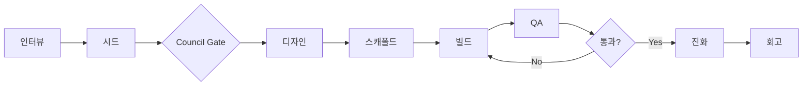

# SAMVIL — AI 바이브코딩 하네스 `v3.1.0`

> **한 줄 입력 → 자가 진화하는 견고한 시스템**
>
> "뿌리의 힘으로 벼려내다" (Sam=인삼 + Vil=모루)
>
> 💡 **권장 모델**: Claude Sonnet 4.6 (Design 기준 측정값 **GLM 25m+ stall 대비 6배+ 가속**, 4m 18s 완료). `references/cost-aware-mode.md` 참조. GLM·GPT도 **v3-017 호환성 보강** 덕분에 작동하지만, 메인 세션만 저비용 모델 두고 설계는 Sonnet에 라우팅하는 **cost-aware mode**가 품질·비용 균형점.

```
/samvil "할일 관리 앱"        → Next.js 웹앱
/samvil "매일 날씨 슬랙봇"    → Python 자동화 스크립트
/samvil "간단한 점프 게임"    → Phaser 웹 게임
/samvil "습관 트래커 모바일"  → Expo 모바일 앱
/samvil "매출 대시보드"       → Recharts 대시보드
```

**v3.1.0 "Interview Renaissance + Universal Builder"** — v3.0.0 AC Tree에 인터뷰 깊이·Stability·모델 호환성을 더해 dogfood 25건을 흡수한 버전.

> **v3.1.0 주요 추가** (2026-04-21):
> - **Deep Mode 인터뷰** (`tier=deep`, ambiguity ≤ 0.005) + Phase 2.6 Non-functional / 2.7 Inversion / 2.8 Stakeholder / 2.9 Customer Lifecycle Journey (8 stages)
> - **Design stall 자동 복구** — state.json heartbeat + 5분 reawake. 모바일 게임 dogfood 25분 hang 회귀 방지
> - **모델 호환성 공식 지원** — Claude/GLM/GPT 모두 작동. cost-aware mode (GLM main + Claude sub) 공식 가이드
> - **Auto-chain 기본 활성** — interview/seed 외에 'go' 승인 prompt 제거
> - **게임 도메인 강화** — lifecycle architecture + mobile spec + art direction (game-art-architect agent)
> - **Automation 외부 API 모델 ID 외부화** — `.env.example`로. deprecated 모델 404 회귀 방지
> - **Council 한글화** — 영어 원문 + 한글 병기, 약어 풀어쓰기, BLOCKING finding 근거 1줄
>
> **검증**: 412 unit tests + SessionStart hook 실제 동작 확인 + 2개 dogfood 누적. 5건 dogfood-dependent는 v3.1.1.

---

**v3.0.0 "AC Tree Era"** — 1인 개발자를 위한 범용 하네스. 견고성(Robustness) 우선, 완성 후 자가 진화(Converge-then-Evolve).

> **⚠️ Breaking change vs v2.x**: AC가 트리 구조로 바뀌었습니다. 기존 v2 프로젝트는 `/samvil:update --migrate` 한 번 실행하면 자동 변환됩니다 (`project.v2.backup.json`로 백업). 자세한 내용: [migration-v2-to-v3.md](references/migration-v2-to-v3.md).
>
> v3.0.0 base: AC Tree · LLM Dependency Planning · Shared Rate Budget · PM Interview Mode. 9-pass internal audit + 370 unit tests.

## 🧬 정체성 (Identity)

1. **Solo Developer First** — 1인 개발자 타겟
2. **Universal Builder** — 웹앱/자동화/게임/모바일/대시보드 5가지
3. **Robustness First** — 견고성 > 속도
4. **Converge, Then Evolve** — 3-level 완성 (Build → QA → Evolve 수렴)
5. **Self-Contained** — 단독 하네스 (외부 MCP Bridge는 future)

상세 철학: [Manifesto v3](~/docs/ouroboros-absorb/MANIFESTO-v3.md) 참조.

---

## 빠른 시작 (5분)

1. **설치**: Claude Code에서 `/install-plugin insamkwon/samvil` 실행
2. **새 세션 열기**: SAMVIL이 자동으로 로드됩니다
3. **실행**: `/samvil "할일 관리 앱"` 입력
4. **인터뷰에 답변**: AI가 객관식으로 물어봐요
5. **완성!** `~/dev/<app-name>/` 에 프로젝트가 생성됩니다

```bash
cd ~/dev/<app-name>
npm run dev    # → localhost:3000
```

---

## 아키텍처



---

## 이게 뭐야?

Claude Code에서 **한 줄**로 앱 아이디어를 말하면, AI가 알아서:

1. 뭘 만들지 **물어보고** (인터뷰)
2. 설계서를 **만들고** (시드)
3. 여러 AI가 설계서를 **토론하고** (Council)
4. 코드를 **짜고** (빌드)
5. 제대로 됐는지 **검증하고** (QA)
6. 다음번엔 더 잘하도록 **반성해** (회고)

결과: **동작하는 앱/스크립트/게임**이 `~/dev/` 폴더에 생성돼요.

---

## 설치

Claude Code에서 한 줄이면 끝:

```
/install-plugin insamkwon/samvil
```

설치 후 **새 세션**을 열면 SAMVIL이 자동으로 로드되고, MCP 서버도 자동 설치+등록됩니다. 필요한 도구(`uv` 등)도 없으면 자동으로 설치해요.

---

## 사용법

### 3가지 모드

| 모드 | 언제 쓰나 | 시작 방법 |
|------|---------|----------|
| **새 프로젝트** | 아이디어만 있을 때 | `/samvil "할일 앱"` |
| **기존 프로젝트 개선** | 이미 코드가 있을 때 | `/samvil` → "기존 프로젝트 개선" 선택 |
| **단일 단계** | 특정 작업만 하고 싶을 때 | `/samvil:qa`, `/samvil:build` 등 |

---

### 새 프로젝트 만들기

```
/samvil "간단한 계산기"
```

시작하면 자동으로:

1. **환경 점검** — Node.js, Python, MCP 등 8가지 자동 체크. 없는 게 있으면 설치 방법 알려줌.
2. **Tier 선택** — 얼마나 꼼꼼하게 만들지 고르기:

| Tier | 뭐가 다른가 | 걸리는 시간 |
|------|-----------|-----------|
| **빠르게** | 질문 적게, 바로 빌드 | ~5분 |
| **일반** | AI 3명이 설계 토론 + 병렬 빌드 | ~10분 |
| **꼼꼼하게** | 깊은 인터뷰 + 디자인 리뷰 | ~15분 |
| **풀옵션** | 36명 AI 에이전트 총동원 | ~20분 |

3. **인터뷰** — AI가 객관식으로 물어봐요. "왜 이걸 만드는지"부터 시작해서 숨은 가정까지 파악. 스택도 추천해줘요.
4. **이후 전부 자동** — 설계 → 코드 → 검증 → 완성!

### 빠르게 만들기 (질문 없이)

```
/samvil "블로그" 그냥 만들어
```

"그냥 만들어"라고 하면 AI가 알아서 판단해서 만들고, 검토 한 번만 받아요.

### 업데이트

```
/samvil:update
```

새 버전이 나오면 시작할 때 자동으로 알려주고, 위 명령으로 업데이트.

---

### 기존 프로젝트 개선하기

이미 만들어진 앱을 개선하고 싶을 때:

```
/samvil
→ "기존 프로젝트 개선" 선택
→ 프로젝트 경로 입력
```

AI가 자동으로 분석해요:

```
[SAMVIL] 프로젝트 분석 완료
━━━━━━━━━━━━━━━━━━━━━━━━━━

구조:
  프레임워크: Next.js 14 (App Router)
  페이지: 5개, 컴포넌트: 12개
  상태관리: Zustand, 데이터: localStorage

코딩 컨벤션:
  컴포넌트: 함수형 (export function)
  파일명: PascalCase.tsx
  폴더: feature별

재사용 가능:
  UI: Button, Card, Input (shadcn/ui)
  훅: useAuth, useToast

통합 포인트 (새 기능 추가 시):
  페이지: app/<feature>/page.tsx
  메뉴: Sidebar.tsx → navItems[]에 추가
  스토어: lib/store.ts에 추가

의존성 영향:
  layout.tsx → 5개 페이지 영향 (수정 주의)
  store.ts → 8개 컴포넌트 사용 중

코드 품질:
  any 사용: 3곳 ⚠️
  빈 상태 처리: 1/5 ⚠️
  로딩 상태: 없음 ❌
```

분석 후 원하는 작업 선택:
- **기능 추가** — 새 기능 코드 작성
- **코드 품질 개선** — 리팩토링, 버그 수정
- **디자인 개선** — UI/UX 개선, shadcn/ui 적용
- **테스트/검증** — 현재 코드 품질 검증만

### 단일 단계 실행

파이프라인 전체가 아니라 원하는 단계만:

```
/samvil:qa          ← 기존 프로젝트 QA 검증만
/samvil:evolve      ← 시드 진화만
/samvil:retro       ← 회고만
/samvil:council     ← Council 토론만
/samvil:build       ← 빌드만
/samvil:analyze     ← 코드 분석만
```

---

## 환경 점검 (자동)

`/samvil` 실행하면 자동으로 8가지를 체크:

```
[SAMVIL] 환경 점검 결과
━━━━━━━━━━━━━━━━━━━━━━
  ✓ Node.js v20.11.0
  ✓ npm 10.2.4
  ✓ Python 3.12.12
  ✓ uv 설치됨
  ✓ GitHub CLI 2.45.0
  ✓ SAMVIL v0.1.0 (최신)
  ✓ MCP 서버 연결됨
━━━━━━━━━━━━━━━━━━━━━━
```

없는 도구가 있으면 **설치 방법을 알려줘요**. Node.js만 필수이고, 나머지는 없어도 기본 기능은 동작합니다.

---

## 파이프라인 상세

```
인터뷰 → 시드 → [Council] → 디자인 → 스캐폴드 → 빌드 → QA → [진화] → 회고
```

| 단계 | 뭘 하나 | 비유 |
|------|---------|------|
| **인터뷰** | "누가 쓸 건가요?" "핵심 기능은?" + 스택 추천 | 고객 미팅 |
| **시드** | 인터뷰 결과를 설계서(JSON)로 정리 + 와이어프레임 미리보기 | 기획서 작성 |
| **Council** | AI 3~7명이 설계서 품질 토론 (과정 투명 공개) | 팀 회의 |
| **디자인** | 화면 구조, 데이터 모델, 아키텍처 결정 + blueprint feasibility 점검 | 설계 회의 |
| **스캐폴드** | CLI로 프로젝트 뼈대 생성 (Next.js / Vite / Astro / Python / Phaser / Expo) | 공사장 세팅 |
| **빌드** | 기능별 코드 작성 (독립 기능은 병렬) + Drift 경고 | 실제 공사 |
| **QA** | 3단계 검증: 빌드 → Playwright Smoke Run → 기능 → 품질 | 품질 검사 |
| **진화** | spec-only 모드로 설계서 수렴 후 최종 빌드 (선택). 시드 버전 히스토리 + diff 자동 저장. 빌드/QA 이벤트 trace를 분석해 반복 패턴 식별 | 피드백 반영 |
| **회고** | 패턴 감지 + 프리셋 축적 제안 + 하네스 개선 3개 | 회고 미팅 |

설계 단계 끝에서 blueprint를 한 번 더 점검해요.
- 라이브러리/구조 충돌이 없는지
- 지금 범위에서 현실적으로 만들 수 있는지
- 문제 있으면 빌드 전에 바로 수정해요

---

## 5가지 솔루션 타입 + 10개 앱 프리셋

### 자동 타입 감지

"할일 앱"이면 웹앱, "매일 날씨 봇"이면 자동화 — SAMVIL이 자동으로 판단:

| 타입 | 감지 키워드 | 생성 결과 |
|------|-----------|----------|
| **web-app** | 할일, 블로그, 쇼핑몰, 랜딩 | Next.js + shadcn/ui |
| **automation** | 자동화, 스크립트, 크롤링, 봇, cron | Python/Node + --dry-run |
| **game** | 게임, game, phaser, 점프 | Phaser 3 + Vite + TS |
| **mobile-app** | 모바일, iOS, Android | Expo + React Native |
| **dashboard** | 대시보드, 차트, 분석 | Next.js + Recharts |

### 앱 프리셋 (웹앱)

| 키워드 | 자동 포함 기능 |
|--------|-------------|
| 할일/todo | CRUD, 완료 토글, 정렬, persist |
| 대시보드 | 차트, 요약 카드, 기간 필터 |
| 블로그 | 글 목록, 마크다운, 카테고리 |
| 칸반 | 드래그앤드롭, 칼럼 관리 |
| 랜딩 | 히어로, CTA, 기능 소개 |
| 쇼핑몰 | 상품 목록, 장바구니, 체크아웃 |
| 계산기 | 입력 UI, 계산 로직, 키보드 |
| 채팅 | 메시지 목록, 입력, 타임스탬프 |
| 포트폴리오 | 프로젝트 갤러리, 소개, 연락처 |
| 설문/폼 | 질문 편집, 미리보기, 응답 수집 |

목록에 없는 앱도 가능 — AI가 자동으로 서치해서 적절한 기본값을 찾아요.

---

## 디자인 프리셋

기본부터 예쁘게. 4가지 테마:

| 테마 | 어울리는 앱 | 특징 |
|------|-----------|------|
| **productivity** | 할일, 칸반, 대시보드 | 깔끔, 밀도 높음, 파란 액센트 |
| **creative** | 블로그, 포트폴리오 | 다크 모드, 보라 액센트 |
| **minimal** | 랜딩, 유틸리티 | 흰 배경, 장식 없음 |
| **playful** | 게임, 교육, 퀴즈 | 밝은 색, 둥근 모서리 |

shadcn/ui 기반이라 컴포넌트가 기본적으로 프로 수준입니다.

---

## Unknown Unknowns 탐지

"할일 앱 만들어"라고만 해도, SAMVIL이 **당신이 생각 못 한 것**을 먼저 짚어줘요:

```
"할일 앱을 깔았다가 1주 만에 삭제한 사람이 있다면, 이유가 뭘까요?"
  □ 동기화가 안 돼서
  □ 너무 복잡해서
  □ 알림이 없어서
  □ Other
```

이 답변이 자동으로 설계에 반영됩니다.

---

## 49명 AI 에이전트

| 역할 | 에이전트 수 | 하는 일 |
|------|-----------|---------|
| 기획 | 9명 | 인터뷰, 시장 조사, 범위 관리 |
| 디자인 | 6명 | UX 설계, UI 검수, 접근성, 반응형 |
| 개발 | 10명 | 프론트엔드, 백엔드, 인프라, 테스트 |
| 검증 | 7명 | 코드 리뷰, QA 3단계, 보안, 성능 |
| 진화 | 3명 | 부족한 점 분석, 개선 제안 |
| 회고 | 1명 | 하네스 자체 개선 |

Tier에 따라 필요한 만큼만 활성화. 간단한 앱에 49명이 달려들진 않아요.

### 타입별 전문 에이전트 (v2.0)

`solution_type`에 따라 해당 타입의 전문 에이전트가 활성화:

| 타입 | 전문 에이전트 | 특화 분야 |
|------|-------------|----------|
| **automation** | 4명 (interviewer, architect, engineer, qa) | Python/Node dry-run, fixtures, 로깅 |
| **game** | 4명 (interviewer, architect, developer, qa) | Phaser scene lifecycle, physics, canvas QA |
| **mobile** | 4명 (interviewer, architect, developer, qa) | Expo Router, React Native, touch QA |
| **dashboard** | 기존 web 에이전트 + dashboard 레시피 | Recharts, data table, CSV export |

**QA Tier 차이**: `minimal`은 기존처럼 메인 세션에서 3-pass를 직접 실행. `standard` 이상은 Pass 2/3를 독립 에이전트가 검증하고 메인 세션이 최종 verdict를 종합합니다 ("Independent Evidence, Central Verdict" 원칙).

---

## Self-Evolution (자동 진화)

SAMVIL은 **쓸수록 좋아져요**:

1. 매 실행마다 **이벤트 로그**가 전체 이력을 기록 (`.samvil/events.jsonl`)
2. 빌드 재시도와 수정도 **structured event trace**로 남겨요 (`build_fail`, `build_pass`, `fix_applied`)
3. 빌드 에러 수정 시 **fix-log**에도 자동 기록 → 같은 에러 반복 방지
4. 회고에서 같은 키워드 3회 이상 반복 시 **패턴 감지** + 자동 수정 제안
4. 새 앱 유형을 만들면 **프리셋으로 자동 축적** 제안
5. Tier 선택 시 **이전 실적** 표시 (성공률, 소요시간)

```
Run #1: "할일 앱" → 완성 → 회고: "scaffold에서 zustand 자동 설치하면 좋겠다"
Run #2: "칸반" → 완성 → 회고: "DnD 라이브러리를 web-recipes에 추가"
Run #3: 이전 제안 반영 + 패턴 감지 → 더 빠르고 안정적
```

### 프로젝트 파일 구조

```
~/dev/<project>/
├── project.seed.json       ← 뭘 만들지 (명세)
├── project.config.json     ← 어떻게 돌릴지 (실행 설정)
├── project.state.json      ← 지금 어디인지 (상태)
├── .samvil/
│   ├── events.jsonl        ← 전체 이벤트 이력
│   ├── fix-log.md          ← 에러 수정 이력
│   ├── build.log           ← 빌드 출력
│   └── qa-report.md        ← QA 결과
└── (앱 코드)
```

---

## 기술 스택

| 구성 | 기술 |
|------|------|
| 플러그인 | Claude Code Plugin (Markdown + hooks) |
| **웹앱** | Next.js 14 / Vite+React / Astro + Tailwind + shadcn/ui + TypeScript |
| **자동화** | Python 3.12 / Node.js + argparse + --dry-run + fixtures/ |
| **게임** | Phaser 3 + Vite + TypeScript (Arcade Physics) |
| **모바일** | Expo + React Native + Expo Router + TypeScript |
| **대시보드** | Next.js + Recharts + date-fns + lucide-react |
| 영속성 | Python MCP Server + SQLite (선택) |
| 에이전트 | 49명 (타입별 전문 에이전트 12명 포함) |
| 모델 라우팅 | config.json으로 작업별 모델 지정 (opus/sonnet/haiku) |

---

## CHANGELOG

### v2.1.0 — Handoff & UX Improvements

**사용자 경험 개선 + 세션 간 연속성 보장**

- **Handoff 패턴**: 각 단계 완료 시 `.samvil/handoff.md`에 누적 append. context limit 도달 시 새 세션에서 완벽 복구. 7스킬 16포인트 적용.
- **시드 요약 개선**: 플레이스홀더 → 실제 값 구조적 요약. solution_type별 분기 (screen 패턴 vs flow 패턴). "이게 내가 원하는 앱이 맞나?" 판단 가능.
- **Council 결과 개선**: 에이전트 1줄 → 섹션별 판결 + 에이전트별 2-3줄 근거 + 반대 의견 상세화.
- **Retro 개선**: suggestion에 ISS-ID + severity(CRITICAL/HIGH/MEDIUM/LOW) + 대상 파일 + 근거 + 기대효과 구조화.
- **구버전 캐시 자동 삭제**: `/samvil:update` 시 최신 버전만 남기고 나머지 삭제. 이중 가드(`-z` + `-d`) + 용량 로깅.
- **Resume 강화**: 오케스트레이터가 handoff.md 읽어서 이전 세션 결정 사항까지 요약 제시.

### v2.0.0 — Universal Builder

**한 줄로 웹앱/자동화/게임/모바일/대시보드 5가지 타입 자동 감지 → 생성**

- **5가지 solution_type**: web-app, automation, game, mobile-app, dashboard
- **3-layer 자동 감지**: L1 키워드 → L2 컨텍스트 → L3 인터뷰 검증
- **자동화 (Python/Node)**: --dry-run 패턴, fixtures/, argparse, API 클라이언트
- **게임 (Phaser 3)**: Scene lifecycle, Arcade Physics, Playwright canvas QA
- **모바일 (Expo)**: React Native, Expo Router, EAS Build 배포
- **대시보드 (Recharts)**: 차트 컴포넌트, data table, CSV export
- **12개 전문 에이전트**: 타입당 4명 (interviewer, architect, engineer, qa)
- **Seed Schema v2**: solution_type, implementation, core_flow 패턴
- **총 에이전트 49명** (기존 37 + 신규 12)
- **4개 레시피 문서**: automation(610줄), game(435줄), mobile(478줄), dashboard(841줄)

- 병렬 Agent 동시 실행 제한 (MAX_PARALLEL=2). CPU 100% 이슈 해결
- Council R1: Haiku, QA: Sonnet, Evolve 2사이클+: Sonnet. Opus 사용 80% 감소
- Worker는 lint/typecheck만, full build는 배치 완료 후 1회. 빌드 횟수 67% 감소
- Agent에게 해당 feature만 전달. QA도 AC 관련만 전달
- 5개 Agent에 Compact Mode 추가
- qa_max_iterations 5 → 3. Ralph Loop 과다 반복 방지
- build_stage_complete 이벤트에 agents_spawned, builds_run 메트릭 추가

### v0.11.0 — Phase 2: Intelligence

- QA Pass 2를 정적 Grep에서 Playwright MCP 런타임 검증으로 전환. 스크린샷 증거 저장
- MCP Dual-Write + 장애 추적. 파일 먼저 기록 → MCP best-effort
- 인터뷰에 DB/Auth/API 질문 추가. Supabase 클라이언트 자동 설정
- next.config.mjs에 output:'standalone'. QA 완료 후 배포 옵션 제시
- Council 간접 토론. Round 1에서 논쟁점 추출 → Round 2 prompt에 주입

### v0.10.0 — Phase 1: Foundation

- `hooks/validate-version-sync.sh` 추가. push 전 버전 일치 검증
- 11개 스킬에 18개 이벤트 타입 MCP 통합. 누락 시 경고
- interview_engine에 tier별 모호도 임계값 적용
- QA Pass 1b에서 dev server 콘솔 에러 + 빈 화면 자동 검출
- Evolve에서 시드 백업 + compare_seeds diff 자동 저장
- config 기반 QA 반복 한도 (기본 3회)
- build_stage_complete에 implementation_rate 기록
- Seed에 AC별 vague_words 태깅. Interview에 AC 재질문 로직

### v0.9.0 — Runtime QA, MCP Resilience

- Blueprint Feasibility Check: 설계 단계 끝에서 blueprint 자동 점검
- Structured Build Events: 빌드 성공/실패, 수정 이력 구조화 기록
- QA Taxonomy Alignment: 4-state 판정 체계 통일 (PASS / PARTIAL / UNIMPLEMENTED / FAIL)
- Independent QA for Standard+: Pass 2/3을 독립 에이전트가 수행
- Independent Evidence, Central Verdict 원칙 도입
- Evolve Artifact Analysis: 반복 에러 패턴과 근본 원인 식별

### v0.8.2 — MCP Integration, Playwright Smoke

- 캐시→리포 동기화. 버전 전체 0.8.2로 통일
- MCP 의무 호출 체계 안정화
- Playwright Smoke Run 기본 동작 확인

---

## 라이선스

UNLICENSED

## 만든 사람

**insam** — "빠르게 만들어서 팔아야 생존한다"
