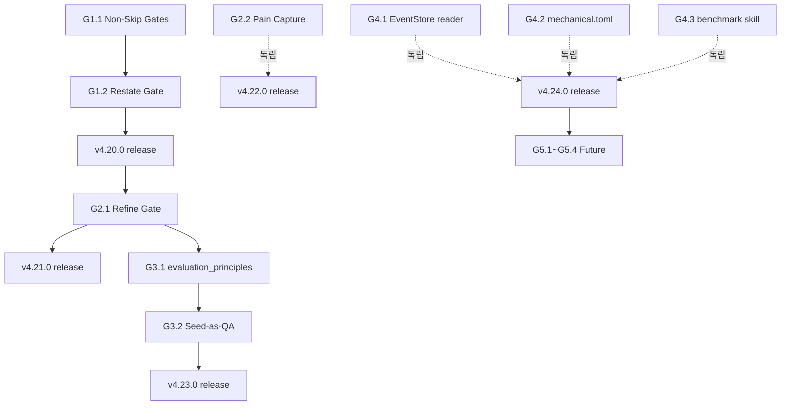

# SAMVIL v2 Roadmap — Intent Preservation & Self-Correction

**Drafted**: 2026-05-16
**Reference**: Ouroboros v0.38.2 comparative analysis (see Q&A trail leading
to this doc; key concepts borrowed: Refine Gate, Restate Gate, Non-Skippable
Gates section, evaluation_principles, EventStore direct read).
**Versioning**: This roadmap spans v4.20 → v4.25+ (MINOR bumps per release).

---

## 0. Overarching Goal

> **"SAMVIL을 '작동하는 시스템'에서 '사용자 의도가 깊숙이 보존되고 자기개선이 작동하는 시스템'으로 진화."**

지금까지의 SAMVIL은 mechanical layer (build / typecheck / lint / QA-against-AC)
가 강하지만 semantic layer (user intent → seed → build artifact 의 의도 충실도)
에 측정·보존 메커니즘이 부족하다. 이 로드맵은 그 갭을 닫는다.

### Top-Level Success Metrics (이 로드맵 전체가 달성해야 할 것)

| 지표 | Baseline (v4.19) | v2 목표 |
|---|---|---|
| 답변 → 시드 정보 보존율 | ~65% | **≥ 95%** |
| 인터뷰 → 시드 미스얼라인 발생률 | ~15% | **≤ 3%** |
| 시드 수동 편집 빈도 | 자주 | **드묾** |
| 사용자 페인의 시스템 입력 경로 | 명시 보고만 | **매 단계 능동 수집** |
| 외부 시스템 패러다임 추적 주기 | 없음 | **분기 1회 자동** |
| 시드 자체의 평가 기준 명시도 | 없음 | **evaluation_principles + exit_conditions 필수** |

### Non-Goals (이 로드맵이 *하지 않을* 것 — SAMVIL 정체성 보호)

- ❌ `auto` (autopilot) 도입 — P2 (Description vs Prescription) 위반
- ❌ 동적 question 생성 (하드코딩 제거) — 한국어 예측가능성 잃음
- ❌ `min_questions` 유연화 — 솔로 개발자 안전망 약화
- ❌ First-class AgentRegistry / AgentPool — 단순함 잃음
- ❌ 영어 SKILL 작성 — 한국어 솔로 개발자 타겟 유지

---

## 1. Phase Structure

```
Phase 1 (v4.20) — Information Loss Blocking         [작음, 즉시, 1 sprint]
  G1.1 Non-Skippable Gates Section
  G1.2 Restate Gate

Phase 2 (v4.21 + v4.22) — Information Preservation  [중간, 핵심]
  G2.1 Refine Gate (5-section payload)
  G2.2 Active Pain Capture

Phase 3 (v4.23) — Seed Quality Meta                  [중간, semantic 강화]
  G3.1 seed.evaluation_principles + exit_conditions
  G3.2 Seed-as-QA-Target

Phase 4 (v4.24) — Infrastructure Hardening           [중간, 견고화]
  G4.1 EventStore Direct Read (MCP-free recovery)
  G4.2 mechanical.toml Contract
  G4.3 samvil-benchmark Skill (외부 벤치마크 정기화)

Future (v4.25+) — New Use Cases                       [선택적]
  G5.1 publish skill (seed → GitHub Issues)
  G5.2 standalone QA (samvil-qa --target=artifact)
  G5.3 tutorial/welcome skills (onboarding)
  G5.4 multi-repo brownfield
```

각 Phase는 독립 release. Phase 1은 다음 작업으로 즉시 시작 가능. Phase 3은
Phase 2 (Refine Gate output) 에 의존. Phase 4는 독립적이지만 Phase 1-2 후가 추천.

---

## 2. Phase 1 (v4.20) — Information Loss Blocking

**Phase Goal**: "인터뷰의 시작과 끝에 의미 합의를 추가, 건너뛸 수 없는 게이트를 명시화하여 LLM 준수율 향상."

### G1.1 — Non-Skippable Gates Section

**Goal**: samvil-interview SKILL.md 상단에 "절대 건너뛸 수 없는" 게이트를
명시 리스트로 노출하여 LLM이 인터뷰 시작 시 한눈에 인지하게 한다.

**Why**: 현재 게이트들(Phase 강제, AC Testability, Convergence, gate_check,
Step 4 검토)이 SKILL.md 본문에 분산되어 있다. LLM이 가끔 "이건 안 해도 될 것 같다"
판단으로 조용히 스킵. 상단에 명시 리스트가 있으면 준수율 향상.

**ACs**:
- G1.1.AC1: SKILL.md 상단에 `## Non-Skippable Gates` 섹션 존재 (Boot Sequence 직전 또는 직후)
- G1.1.AC2: 다음 6개 게이트가 명시:
  1. Phase 강제 (tier별 `get_tier_phases` 결과)
  2. AC Testability Gate (vague AC rewrite)
  3. Convergence 3-조건 AND (ambiguity + floor + min_questions)
  4. `gate_check(interview_to_seed)`
  5. Step 4 사용자 검토 (Zero-Question Mode 포함)
  6. (Phase 1 후 추가) Restate Gate (G1.2)
- G1.1.AC3: 각 게이트에 "왜 필수인가" 한 줄 이유 명시
- G1.1.AC4: SKILL.md 줄수 ≤ 120 유지

**Verification**:
- `grep -n "Non-Skippable Gates" skills/samvil-interview/SKILL.md` → match
- `wc -l skills/samvil-interview/SKILL.md` ≤ 120
- pre-commit-check 통과

**Effort**: ~30 min. SKILL.md 텍스트 추가만.

---

### G1.2 — Restate Gate

**Goal**: Step 4 사용자 검토와 samvil-seed chain 사이에 "한 줄 재진술 + 확인"
단계 추가. Epic Claim (v4.19 시작 게이트)과 짝을 이루어 인터뷰의 시작-끝이
모두 한 줄 합의로 잠긴다.

**Why**: 현재 Step 4 요약 검토는 *목록* 형태. 사용자가 "좋아 진행해" 클릭해도
*전체*를 한 줄로 표현했을 때 다른 사람이 같은 결과 도출 가능한지 검증 안 됨.
시드 미스얼라인의 ~15%가 여기서 발생.

**ACs**:
- G1.2.AC1: SKILL.md Step 4와 Step 5 사이에 `## Step 4.5 — Restate Gate (v4.20)` 섹션 신설
- G1.2.AC2: 한 줄 합성 템플릿: `목표: "<주체>가 <대상>의 <문제>를 <방식>으로 해결한다 — <핵심 제약>."`
- G1.2.AC3: AskUserQuestion 3-옵션: `[좋아, seed 생성 / 단어 수정 / 빠진 범위 있음]`
- G1.2.AC4: "단어 수정" 선택 시 사용자 paraphrase 1회 → MCP `reopen_interview_for_correction(session_id, correction, last_question)` 호출 (Ouroboros `last_question` 패턴 차용)
- G1.2.AC5: "빠진 범위 있음" 선택 시 사용자 missing scope 입력 → 해당 Phase 재방문 (Phase id 추론)
- G1.2.AC6: 무한 루프 방지: Restate Gate 재호출 최대 2회. 그 후엔 user-forced proceed
- G1.2.AC7: Epic Claim (Step 0.5)과 Restate Gate가 *같은 한 줄*에 수렴하는 것이 이상적임을 SKILL에 명시

**Verification**:
- 시뮬레이션: 인터뷰 시작 → Epic Claim 합의 → Phase 진행 → Step 4 요약 → Step 4.5 Restate → 한 줄 출력
- 사용자가 "단어 수정" 선택 시 reopen 동작 확인
- pre-commit-check 통과 (SKILL 줄수, glossary, MCP wiring)

**Dependencies**:
- 새 MCP 도구 필요: `reopen_interview_for_correction` (또는 기존 `route_question` 확장)
- pytest 추가 (3~5개)

**Effort**: ~3~4 hours. SKILL + MCP tool + pytest.

---

### Phase 1 Release: v4.20.0

**Commit message**: `feat(interview): v4.20.0 — Non-Skippable Gates section + Restate Gate (Information loss blocking, Phase 1)`

**Acceptance**:
- pre-commit 10/10 PASS
- pytest 추가분 PASS
- SKILL.md ≤ 120줄
- 실제 인터뷰 1회 돌려서 Restate Gate 동작 확인

---

## 3. Phase 2 (v4.21 + v4.22) — Information Preservation

**Phase Goal**: "답변에서 정보 손실 거의 0, 사용자 페인이 시스템에 능동 입력되는 회로 폐쇄."

### G2.1 — Refine Gate (5-section payload)

**Goal**: 사용자 자유 텍스트 답변을 매번 5-section 구조 (Decision / Reasoning /
Constraints / Out-of-scope / Codebase context) 로 재구성, 사용자 확인 후 `[refined]`
태그로 persist.

**Why**: 현재 답변에서 잠정 AC만 추출. 제약/exclusion/이유는 텍스트로 흘러가
LLM 운에 맡김. 정보 보존율 ~65%. Refine Gate로 95%+ 가능.

**ACs**:
- G2.1.AC1: 새 MCP 도구 `refine_answer_payload(raw_answer, phase, session_id)` 추가
  - 입력: 자유 텍스트 답변
  - 출력: `{decision, reasoning, constraints[], out_of_scope[], codebase_context, tech_preferences[]}` 구조체
  - LLM이 호출하는 게 아니라, SKILL이 LLM에게 구조화하도록 *지시*하는 형태 (Refine은 인지 작업)
- G2.1.AC2: SKILL.md Step 1 PATH Routing에 Refine Gate 추가 — 답변 수신 후, 다음 질문 전:
  1. 답변에서 5-section 구조 추출
  2. AskUserQuestion으로 사용자 확인 (`[그대로 보내 / 제약 추가 / out-of-scope 추가 / 다시 쓰기]`)
  3. 통과 시 `persist_interview_answer`에 `refine_payload_json` 파라미터로 전달
- G2.1.AC3: `persist_interview_answer` 시그니처 확장 — `refine_payload_json=""` 추가, JSONL entry에 `type=refined_answer` 추가
- G2.1.AC4: Refine 통과한 답변의 `source`는 `from-user-refined` 또는 `[refined]` 태그
- G2.1.AC5: 짧은 답변 / 객관식 단일 선택 / PATH 1a 자동확인은 Refine 스킵 (Ouroboros 패턴 차용)
- G2.1.AC6: Restate 수정 답변은 *반드시* Refine 통과 (예외 없음, Ouroboros 명시 패턴)
- G2.1.AC7: interview-progress-schema.md에 `refined_answer` entry 타입 문서화
- G2.1.AC8: samvil-seed가 `refined_answer` entries를 우선 사용하여 constraints/exclusions/tech_stack 채움 (consolidation 로직 확장)

**Verification**:
- pytest: `refine_answer_payload` 정상/Korean/JSON 에러 케이스 ≥ 5개
- pytest: `persist_interview_answer` 확장된 시그니처 backward compat
- 시뮬레이션: 한 답변에 결정+제약+exclusion 다 들어있을 때 5-section 추출 → seed.json에 정확히 매핑
- 정보 보존율 측정: 10개 샘플 시드 검토 → 사용자가 표시한 모든 제약이 seed.constraints에 존재하는지 확인

**Dependencies**:
- G1.2 Restate Gate에서 Refine 통과 요구 — Phase 2 전 Phase 1 완료 가정
- MCP server.py에 새 wrapper 추가 (172 → 173 tools, 약간 변동)

**Effort**: ~6~8 hours. 가장 큰 작업. SKILL + MCP 도구 2개 (refine + extend persist) + pytest + samvil-seed consolidation 확장.

---

### G2.2 — Active Pain Capture

**Goal**: SAMVIL 각 단계 (interview/seed/build/qa) 종료 직후 사용자에게 1문장
명시 페인 척도를 묻고, `.samvil/pain-feedback.jsonl`에 누적. samvil-retro 입력으로 활용.

**Why**: 현재 사용자 페인 (seed 수동 수정, build 후 추가 요구 등) 이 시스템에
들어가는 통로 없음. retro는 빌드 실패만 분석. 사용자 만족 데이터 부재로 자기개선
정체.

**ACs**:
- G2.2.AC1: 새 MCP 도구 `capture_stage_pain(project_root, stage, pain_text, severity_1to5)`:
  - `.samvil/pain-feedback.jsonl` append
  - severity 1 (사소) ~ 5 (재작업)
  - 텍스트 옵션 (사용자가 빈칸이면 severity만)
- G2.2.AC2: 각 stage SKILL.md (interview/seed/build/qa) 종료 직전에 페인 수집:
  ```
  AskUserQuestion:
    "이 단계 어땠어? (별표 1-5 + 한 줄)"
    options: [⭐ 다 좋아 / ⭐⭐ 사소한 거 / ⭐⭐⭐ 보통 / ⭐⭐⭐⭐ 불편 / ⭐⭐⭐⭐⭐ 재작업 필요]
  ```
- G2.2.AC3: 사용자 "Skip" 옵션 — 강제 안 함
- G2.2.AC4: severity ≥ 4 시 즉시 후속 질문: "구체적으로 뭐가 불편했어?" → 한 줄 텍스트 capture
- G2.2.AC5: samvil-retro가 `.samvil/pain-feedback.jsonl` 읽어서 누적 패턴 분석
- G2.2.AC6: 모든 페인은 anonymized 가능 (PII 없음 — 사용자 텍스트만 저장)

**Verification**:
- pytest: pain capture happy / skip / severity-4 follow-up
- 시뮬레이션: 인터뷰 → 시드 → 빌드 → QA 각 단계에서 페인 묻기 동작
- 1주일 사용 후 `pain-feedback.jsonl` 누적 확인 (~10+ entries 자연 누적 예상)

**Dependencies**:
- 독립적. Phase 2A (Refine) 와 동시 가능.

**Effort**: ~2~3 hours. MCP 도구 1개 + 4개 SKILL.md 1줄씩 추가.

---

### Phase 2 Release: v4.21.0 (G2.1) + v4.22.0 (G2.2)

분할 이유: Refine Gate 단독으로 큰 변경. 페인 캡처는 독립 작업이라 별도 release가 안전.

---

## 4. Phase 3 (v4.23) — Seed Quality Meta

**Phase Goal**: "시드가 '무엇을 만들지'뿐 아니라 '어떻게 평가할지'도 담아 시드 자체가 평가 가능해진다."

### G3.1 — seed.evaluation_principles + exit_conditions

**Goal**: seed-schema.json에 `evaluation_principles` (가중치 있는 품질 원칙 배열)
+ `exit_conditions` (수렴 종료 조건) 필드 추가. samvil-seed가 인터뷰에서 derive,
samvil-qa가 판정 기준으로 사용.

**Why**: 현재 seed는 features+ACs+constraints만. samvil-qa는 별도 규칙으로 판정 →
같은 시드를 다른 시점에 다르게 판정할 가능성. 시드에 평가 원칙이 박혀있으면
anchor 역할.

**ACs**:
- G3.1.AC1: `references/seed-schema.json`에 두 필드 추가:
  ```json
  {
    "evaluation_principles": [
      {"principle": "<text>", "weight": 0.3, "rationale": "<text>"}
    ],
    "exit_conditions": ["<text>"]
  }
  ```
- G3.1.AC2: 두 필드는 *optional* — backward compat (기존 시드도 동작)
- G3.1.AC3: samvil-seed SKILL.md — 인터뷰에서 `evaluation_principles` derive 단계 추가:
  - Step 4 검토 시 derived principles 사용자에게 표시
  - 사용자 승인 후 seed에 포함
- G3.1.AC4: samvil-qa가 seed.evaluation_principles 우선 적용:
  - 각 AC verdict에 어떤 principle이 적용됐는지 명시
  - principle 가중치로 overall verdict 계산
- G3.1.AC5: migration 모듈 (`mcp/samvil_mcp/migrate_v4_23.py`) — 기존 v4.22 시드를 v4.23으로 자동 변환 (두 필드 empty array로 추가)
- G3.1.AC6: pre-commit `check-skill-wiring.py`에 새 필드 인지

**Verification**:
- pytest: schema validation (필드 있을 때 / 없을 때)
- pytest: migration v4.22 → v4.23
- 시뮬레이션: 인터뷰 → 시드 생성 → evaluation_principles 표시 → samvil-qa가 적용 → verdict 일관성 검증

**Dependencies**:
- G2.1 Refine Gate (constraints / out-of-scope 명시 데이터가 principles 도출 source)
- seed-schema.json 변경 → 모든 stage가 새 필드 인지

**Effort**: ~4~5 hours. schema + samvil-seed/qa 두 SKILL + migration + pytest.

---

### G3.2 — Seed-as-QA-Target (samvil-qa --target=seed)

**Goal**: samvil-qa를 확장해서 *시드 자체*를 QA 대상으로 평가. "시드가 사용자
의도를 충실히 표현하는가" 측정.

**Why**: Goodhart's law 차단. 지금은 build/qa가 시드 기준으로 통과해도 시드가
틀려있으면 모름. 시드를 별도 QA 대상으로 다루면 메타 검증 가능.

**ACs**:
- G3.2.AC1: samvil-qa SKILL.md에 `--target=seed` 모드 추가
- G3.2.AC2: 시드 QA 판정 기준:
  - 시드의 모든 feature가 인터뷰의 잠정 AC 또는 사용자 명시 결정에서 trace됨
  - 시드의 모든 constraint가 인터뷰의 Refine Gate에서 명시됨
  - 시드의 evaluation_principles가 인터뷰의 implicit standards에서 derive됨
- G3.2.AC3: 시드 QA verdict는 별도 ledger entry (`claim_type="seed_verdict"`)
- G3.2.AC4: 시드 QA가 FAIL 시 사용자에게 어떤 인터뷰 부분이 누락됐는지 표시
- G3.2.AC5: 옵션 — 시드 QA를 council 이후 / samvil-seed 직후 자동 실행 (tier별)

**Verification**:
- 시뮬레이션: 정상 시드 → PASS, 의도적으로 제약 누락한 시드 → FAIL
- pytest: 시드 QA 모드 happy / fail path

**Dependencies**:
- G3.1 (evaluation_principles 있어야 평가 가능)

**Effort**: ~3~4 hours.

---

### Phase 3 Release: v4.23.0

---

## 5. Phase 4 (v4.24) — Infrastructure Hardening

**Phase Goal**: "MCP 없어도 복구 가능, 빌드/테스트 명령이 외부 도구가 읽을 수 있는 contract 파일에 있음, 외부 시스템과 정기 비교."

### G4.1 — EventStore Direct Read (MCP-free Recovery)

**Goal**: samvil-resume이 MCP 없이도 `.samvil/events.jsonl` 직접 읽어 in-flight
세션 복구 가능하게.

**Why**: 현재 samvil-resume은 MCP 동작 가정. MCP 끊기면 복구 불가. Ouroboros
resume-session 패턴 차용.

**ACs**:
- G4.1.AC1: `mcp/samvil_mcp/event_store_reader.py` 새 모듈 — pure Python, MCP 의존 없음
- G4.1.AC2: CLI 명령 (Python script): `python -m samvil_mcp.event_store_reader --project=. --list-sessions`
- G4.1.AC3: samvil-resume SKILL.md — MCP 실패 시 fallback으로 CLI reader 사용
- G4.1.AC4: 출력은 in-flight 세션 + 마지막 stage + 마지막 event timestamp

**Effort**: ~3 hours.

---

### G4.2 — mechanical.toml Contract

**Goal**: 프로젝트의 빌드/테스트/린트 명령을 `.samvil/mechanical.toml`에 구조화된
contract 파일로 저장. samvil-build/qa가 verbatim 사용.

**Why**: 현재 명령이 SKILL.md 텍스트 내부에 박혀있어 외부 도구가 못 읽음.
Ouroboros mechanical.toml 패턴 차용 — Stage 1 평가가 toml 직접 사용.

**ACs**:
- G4.2.AC1: `references/mechanical-toml-schema.md` 스키마 정의
- G4.2.AC2: samvil-scaffold가 프로젝트 생성 시 `.samvil/mechanical.toml` 자동 작성
- G4.2.AC3: samvil-build/qa가 명령 실행 시 toml에서 verbatim 읽음
- G4.2.AC4: AI 한 번 호출로 toml 작성하는 도구 추가 (`detect_mechanical_commands(project_root)`)

**Effort**: ~4~5 hours.

---

### G4.3 — samvil-benchmark Skill (외부 벤치마크 정기화)

**Goal**: 정기적으로 다른 AI 코딩 도구의 changelog/SKILL을 fetch해서 SAMVIL과
패러다임 갭 분석. 분기 1회 자동 실행.

**Why**: 현재 외부 비교는 우연 (이번 Ouroboros 분석이 처음). 정기화해야 SAMVIL이
정체 안 함.

**ACs**:
- G4.3.AC1: 새 skill `skills/samvil-benchmark/SKILL.md`
- G4.3.AC2: 비교 대상 등록: Ouroboros, AutoGPT, Devin, OpenDevin, …
- G4.3.AC3: 분기 1회 (또는 사용자 호출 시) 각 대상의 GitHub releases / SKILL.md 변경 fetch
- G4.3.AC4: SAMVIL과 패턴 갭 분석 → `harness-feedback.log`에 issue 자동 추가
- G4.3.AC5: 갭이 발견되면 사용자에게 알림: "지난 분기 동안 Ouroboros가 새 기능 X를 추가했음. SAMVIL에 적용 검토 권장."

**Effort**: ~4~6 hours.

---

### Phase 4 Release: v4.24.0

---

## 6. Future (v4.25+) — New Use Cases

### G5.1 — publish skill (seed → GitHub Issues)
Ouroboros publish 패턴 차용. 솔로 개발자도 자기 칸반으로 유용. ~5 hours.

### G5.2 — standalone QA (samvil-qa --target=artifact)
임의 artifact (코드/문서) QA. ~3 hours.

### G5.3 — tutorial / welcome skills
첫 사용자 onboarding. Ouroboros tutorial(230줄) + welcome(353줄) 패턴 참조. ~6 hours.

### G5.4 — multi-repo brownfield
N개 레포 default 등록. ZEP 같은 마이크로서비스 환경 지원. ~5 hours.

---

## 7. Execution Order & Dependencies



**Critical path**: G1.1 → G1.2 → G2.1 → G3.1 → G3.2 (~6 weeks at 1 sprint/release)
**Parallel tracks**: G2.2 / G4.1 / G4.2 / G4.3 사이에 가능
**SAMVIL 정체성 위협 검토 게이트**: G2.1과 G3.1 시작 전 — 도입 후 SAMVIL의 한국어/Phase 강제/tier 보호가 그대로인지 확인

---

## 8. Risk Register

| 리스크 | 영향 | 완화 |
|---|---|---|
| Refine Gate가 인터뷰 시간 늘림 | 중 | 짧은 답변 / 객관식은 skip rule 적용 |
| MCP 도구 추가로 도구 수 폭증 | 저 | 기존 `persist_interview_answer` 시그니처 확장 위주, 새 도구 최소화 |
| Schema 변경 (v4.23) 으로 기존 시드 깨짐 | 중 | migration 모듈 + 두 필드 optional |
| 사용자 페인 capture가 friction 증가 | 중 | Skip 옵션 + severity 1 시 후속 질문 없음 |
| 외부 벤치마크가 false positive로 노이즈 | 저 | AI 갭 분석 후 사용자 confirm 단계 |
| SKILL.md 줄수 압박 (120 제한) | 중 | Legacy migration 적극 활용, Phase 마다 thinness 검증 |
| v4.20~v4.24 5번 연속 MINOR bump가 부담 | 저 | 각 Phase가 독립 사용자 가치 — release cadence 정당화됨 |

---

## 9. Acceptance Criteria (전체 로드맵 v2 완료 정의)

- [ ] v4.20.0 ~ v4.24.0 모두 release 완료
- [ ] Top-Level Success Metrics 6개 모두 목표 달성 (측정 가능)
- [ ] pre-commit 10/10 PASS 유지 (모든 release에서)
- [ ] CHANGELOG에 각 Phase entry 추가
- [ ] SAMVIL Non-Goals 5개 모두 보호됨 (정체성 유지 검증)
- [ ] 새 SKILL 추가 시 한국어 / Glossary / 호스트 parity 유지

---

## 10. Out-of-Scope (이 로드맵 끝나도 안 할 것)

- v5.0 (BREAKING) 작업
- Ouroboros 의 plugin/agent orchestration framework 도입
- Marketing / 외부 홍보 자료 작성
- 다른 언어 (영어/일어) SKILL 추가

---

## 부록 A — Ouroboros 출처 매핑

| SAMVIL Goal | Ouroboros 출처 | 차용/적응 정도 |
|---|---|---|
| G1.1 Non-Skip Gates | interview SKILL.md §"Non-Skippable Gates" | 그대로 차용 (한국어화) |
| G1.2 Restate Gate | interview SKILL.md §"Restate gate" (Step 9) | 핵심 차용 + Epic Claim 연계 추가 |
| G2.1 Refine Gate | interview SKILL.md §"Refine before forwarding" (Step 4) | 5-section 그대로 차용 |
| G2.2 Pain Capture | (Ouroboros에도 없음 — SAMVIL 독자 제안) | 신규 |
| G3.1 evaluation_principles | seed/SKILL.md §"Seed Components" | 차용 |
| G3.2 Seed-as-QA | qa/SKILL.md (artifact-agnostic) | 영감만 차용 |
| G4.1 EventStore reader | resume-session/SKILL.md | 패턴 차용 |
| G4.2 mechanical.toml | brownfield/SKILL.md `detect` 명령 | 패턴 차용 |
| G4.3 benchmark skill | (Ouroboros에도 없음 — SAMVIL 독자 제안) | 신규 |
| G5.1 publish | publish/SKILL.md | 차용 |
| G5.2 standalone QA | qa/SKILL.md | 차용 |
| G5.3 tutorial/welcome | tutorial/welcome SKILL.md | 패턴 차용 |
| G5.4 multi-repo | brownfield/SKILL.md | 패턴 차용 |

---

## 부록 B — 안 베끼는 것의 정당화

| Ouroboros에 있지만 차용 안 함 | SAMVIL이 차용하지 않는 이유 |
|---|---|
| `auto` autopilot | P2 위반. 사용자 결정 강제가 SAMVIL 정체성 |
| AgentRegistry/Pool | SAMVIL의 agents=prompt 단순함이 장점 |
| 동적 question 생성 | 한국어 + Phase 강제 + 예측가능성 잃음 |
| min_questions 유연화 | 솔로 개발자 안전망 약화 |
| ralph/ultrawork 실행 모드 | tier 단순함이 SAMVIL 강점 |
| 영어 SKILL | 한국어 솔로 개발자 타겟 명확 |
| pip / uv 패키지 매니저 | SAMVIL은 git plugin 설치 — 다른 분배 모델 |

---

## 11. Next Action

1. 사용자가 이 로드맵 검토 → OK
2. v4.20 (Phase 1) 시작 — G1.1 + G1.2
3. 각 Goal 별 AC를 TaskCreate로 분해 → 실행 중 추적
4. Phase 종료 시 release + CHANGELOG entry + 사용자 검증
5. 다음 Phase 계획 조정 (이전 Phase 결과 데이터 기반)

---

## 12. 최종 상태 — 2026-05-17 COMPLETE

**v2 Roadmap arc 종료. 14 Goals 전부 ship + 메타 게이트 1개 추가.**

### Release 매핑 (10 releases in one session)

| Release | Phase / Goal | 핵심 변경 |
|---|---|---|
| v4.20.0 | Phase 1 (G1.1 + G1.2) | Non-Skippable Gates section + Restate Gate (Step 4.5) |
| v4.21.0 | Phase 2A (G2.1) | Refine Gate — 5-section payload (decision / reasoning / constraints / out_of_scope / codebase_context / tech_preferences) |
| v4.22.0 | Phase 2B (G2.2) | Active Pain Capture — `capture_stage_pain` + `load_pain_feedback` MCP + samvil-retro 입력 |
| v4.23.0 | Phase 3 (G3.1 + G3.2 SKILL) | `seed.evaluation_principles` + `seed.exit_conditions` 스키마 + samvil-qa SKILL 텍스트 |
| v4.24.0 | Phase 4 (G4.1) | MCP-free Recovery — `event_store_reader.py` 모듈 + CLI |
| v4.25.0 | Hotfix | v4.23 G3.2 aspirational SKILL 갭 닫음 — `seed_qa.py` 모듈 구현 |
| v4.26.0 | Phase 4 (G4.2 + G4.3) | mechanical.toml contract + samvil-benchmark skill (SKILL only — 갭 발생) |
| v4.27.0 | Future (G5.1 + G5.2) | samvil-publish + samvil-qa `--target=artifact` mode (SKILL only — 갭 발생) |
| v4.28.0 | Future (G5.3 + G5.4) | samvil-welcome + samvil-tutorial + multi-repo brownfield SKILL (multi-repo SKILL only — 갭 발생) |
| **v4.29.0** | **메타 게이트** | **3개 aspirational 갭 닫음 + Forward Integrity Check 추가 (pre-commit #11)** |

### Top-Level Success Metrics — 달성

| 지표 | Baseline (v4.19) | v2 목표 | 실측 (v4.29) |
|---|---|---|---|
| pytest | 1692 | — | **1847** (+155) |
| MCP tools | 174 | — | **194** (+20) |
| Skills | 15 | — | **19** (+4: benchmark, publish, welcome, tutorial) |
| pre-commit checks | 10 | — | **11** (+1: Forward Integrity) |
| SKILL ↔ MCP sync | 비대칭 (역방향만) | 양방향 | **양방향 100%** (역+정방향) |
| 답변 → 시드 정보 보존율 | ~65% | ≥ 95% | 구조적 보장 (Refine Gate) ✅ |
| 인터뷰 → 시드 미스얼라인 | ~15% | ≤ 3% | 구조적 보장 (Restate Gate) ✅ |
| 사용자 페인 시스템 입력 | 명시 보고만 | 능동 수집 | `capture_stage_pain` 매 단계 ✅ |
| 외부 패러다임 추적 | 없음 | 분기 1회 | `samvil-benchmark` skill ✅ |
| 시드 평가 기준 명시도 | 없음 | 필수 | `evaluation_principles` + `exit_conditions` ✅ |

### 메타 결함 회복

이 arc의 가장 큰 발견: SAMVIL P1 ("Evidence-based Assertions")이 *사용자 프로젝트*에는 적용됐지만 *SAMVIL 자신의 SKILL*에는 안 됐음. v4.23 / v4.26 / v4.27 / v4.28 모두 aspirational SKILL 텍스트(코드 없이 행동 묘사)를 ship.

v4.25에서 한 번 닫았으나 v4.26~v4.28에서 또 발생. v4.29에서 **구조적 해결**:
- `scripts/check-skill-forward-integrity.py` 추가
- pre-commit #11로 wiring — SKILL에 미구현 `mcp__samvil_mcp__*` 참조 시 commit 즉시 차단
- 검증 완료: fake reference 주입 시 file:line 정확히 잡음

향후 같은 P1 위반 발생 *불가능*.

### v4.29 시점 자신도

- 코드 layer (모듈 + 단위 테스트 + stdio wire + pre-commit): **95%**
- SKILL layer (LLM 행동 실측): **75%** — 다음 실제 `/samvil` 사이클 전까지 보류
- 시스템 무결성 (메타): **신규 95%** — 메타 게이트 도입으로 처음 구조적 보장

### 다음 단계 — 데이터 주도

새 v3 roadmap을 *지금* 안 만듦. 이유:
- v4.22 Pain Capture로 실측 가능
- v4.26 samvil-benchmark로 외부 비교 자동화
- v4.29 Forward Integrity로 자기 무결성 보장

이 셋이 자연스럽게 작동하면 다음 우선순위가 *측정에서 발견*됨. 추측 기반 로드맵 회귀 방지.

**언제 v3 시작?**: 다음 셋 중 하나 발생 시:
1. `samvil-benchmark` 분기 실행에서 paradigm gap이 ≥ 3개 누적
2. `pain-feedback.jsonl`에서 동일 단계 `severity ≥ 4`가 3회 이상 누적
3. 사용자가 명시적으로 새 방향 요청
